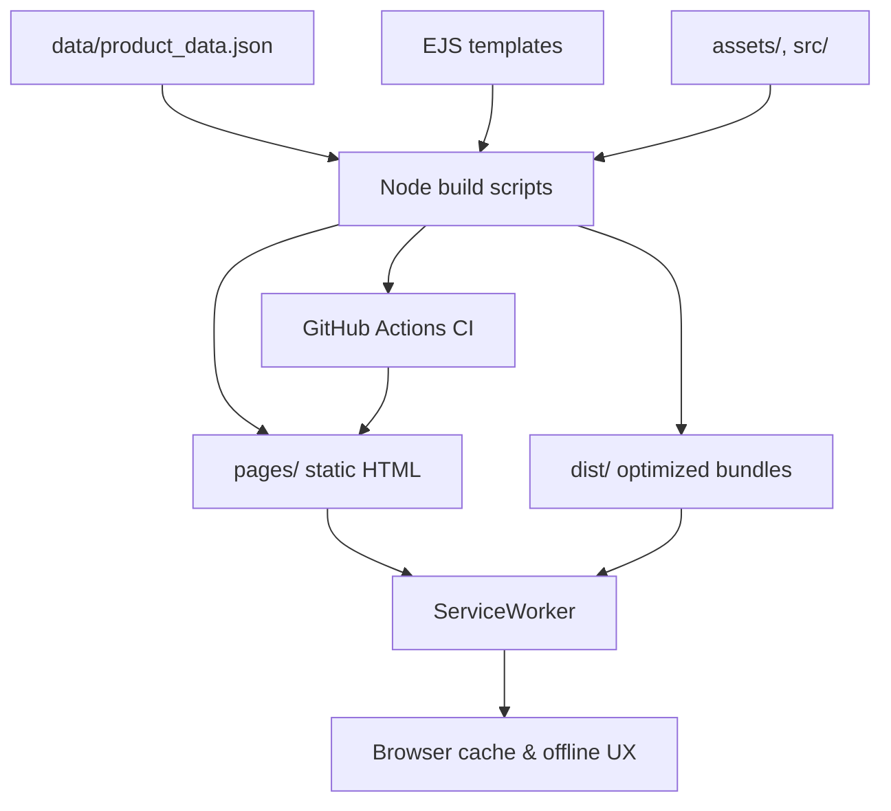

# El Rincón de Ébano – Offline-first catalog with disciplined automation

Providing a bilingual-friendly grocery catalog that ships as a static site, pre-caches critical assets, and keeps operations reproducible through scripted builds.

   

## Features
- Generate static category, product, and offline pages from EJS templates plus structured JSON data (`tools/build*.js`).
- Ship an offline-first service worker with cache expiry controls and message channels for deterministic hydration fallbacks. 
- Orchestrate responsive AVIF/WebP asset pipelines with Sharp and automated GitHub Actions image rewrites. 
- Inject schema.org structured data, preload hints, and robots metadata as part of the deterministic build chain. 
- Exercise multiple layers of verification: node:test suites, Playwright anti-flicker checks, Cypress menu regression, and stylesheet order linting. 
- Maintain reproducible operations with Volta-pinned runtime, npm lockfile, and backup pruning scripts for catalog data. 

> ```js
> // service-worker.js
> const CACHE_CONFIG = {
>   prefixes: {
>     static: 'ebano-static-v6',
>     dynamic: 'ebano-dynamic-v4',
>     products: 'ebano-products-v5'
>   }
> };
> // Versioned prefixes make cache busting explicit, avoiding stale assets after data refreshes.
> ```

## Tech Stack
- **Runtime:** Node.js 22.x (Volta + `.nvmrc` guardrails). 
- **Build tooling:** Custom Node scripts with esbuild, Sharp, undici, and Lighthouse. 
- **Frontend:** Static HTML/CSS/Bootstrap 5, vanilla JS modules, service worker orchestration. 
- **Testing:** node:test, Playwright, Cypress, CSS order lint, Lighthouse audits in CI. 
- **Automation:** GitHub Actions for CI, Pages deploy, image optimization, and Codacy SARIF upload. 

## Architecture at a Glance


## Quick Start
1. `nvm use 22` – align with the Volta/CI runtime (`>=22 <25`).
2. `npm ci` – install dependencies deterministically.
3. `npm run build` – generate `pages/`, `dist/`, and sitemap artifacts.
4. `npx serve pages -l 4173` – preview the static build locally (swap with your preferred static server).

_No environment variables are required for the default build. Optional flags such as `FULL_REGEN` or `LH_SKIP_BUILD` fine-tune heavy scripts and are documented inline in `tools/`._

### Product image workflow (WebP + AVIF)
- Every catalog entry still needs a traditional fallback image (`image_path`) in `assets/images/` using one of the existing extensions (`.png`, `.jpg`, `.jpeg`, `.gif`, `.webp`).
- AVIF assets are now optional but supported through a new `image_avif_path` field stored alongside products in `data/product_data.json`.
- The Node build emits `<picture>` tags and serves AVIF when browsers advertise support, while preserving the WebP/JPEG fallback for Safari/legacy clients.
- Offline Product Manager and the admin panel expose new fields so you can paste the AVIF relative path (e.g. `assets/images/bebidas/Coca.webp` + `assets/images/bebidas/Coca.avif`). The dialog also offers a helper button to copy AVIF files into the canonical assets directory.
- Keep both files committed and run `npm run build` after changes; the new GitHub Action (`product-data-guard.yml`) fails the build if generated artifacts fall out of sync with committed data.

## Quality & Tests
| Check | Command | Notes |
| --- | --- | --- |
| Unit tests | `npm test` | node:test suite passes (`# pass 7`, `# fail 0`). |
| CSS entrypoint order | `npm run check:css-order` | Guards against regressions in `<link>` ordering. |
| Playwright regression | `npm run test:e2e` | Validates navbar/cart flicker budgets (CI installs Chromium). |
| Cypress smoke | `npm run test:cypress` | Ensures navigation menu parity with production templates. |
| Lint | `npx eslint .` | Enforces repo-wide JS/TS standards. |
| Lighthouse audit | `npm run lighthouse:audit` | Reuses last build via `LH_SKIP_BUILD=1` in CI. |

*Coverage reporting is not yet instrumented — integrate `c8` and surface reports before claiming metrics.*

## Performance & Accessibility
- Lighthouse script runs against both desktop and mobile profiles; results land in `reports/lighthouse/` for traceability. 
- Service worker caches HTML, assets, and product data with expiry metadata to keep INP budgets in check while avoiding stale catalog listings. 
- Image workflows generate AVIF/WebP plus fallbacks, reducing payloads before pages reach GitHub Pages. 

## Roadmap
- Publish `LICENSE` file matching the ISC declaration for distribution clarity.
- Add `c8` coverage instrumentation and surface results in CI badges.
- Automate visual diffing from the existing Playwright suite to guard marketing-critical pages.
- Document the Python → Node data sync between `admin/` scripts and `data/product_data.json` for future contributors.
- Introduce scheduled build snapshots that archive `pages/` outputs for release notes.

## Why It Matters
- Demonstrates ownership of an offline-first UX with cache versioning and graceful degradation, reflecting production-readiness for PWA work. 
- Shows ability to codify operational tasks (fonts, icons, sitemap, backups) as idempotent scripts rather than wiki steps. 
- Validates quality gates across layers (unit, e2e, accessibility) similar to what I enforce in regulated delivery pipelines. 
- Highlights CI discipline with pinned Node versions, npm caching, and reproducible builds for deterministic deploys. 
- Emphasizes maintainability through documented scripts, Volta pinning, and automation-first image management. 

## Contributing & License
Contributions via pull request are welcome — please run the CI suite (`npm run build`, `npm test`, `npm run check:css-order`, `npm run test:e2e`) before submitting. The project is licensed under ISC as declared in `package.json`; add a root `LICENSE` file before publishing externally. 

## Contact & Portfolio
- GitHub: [Repository owner](../../..)
- Issues: [Open a new discussion](../../issues/new/choose)
- Portfolio / LinkedIn: _Add personal links here before sharing with employers._

---

*Footnote:* capture a Lighthouse report (`npm run lighthouse:audit`) and store it under `docs/` when preparing for review sessions.
