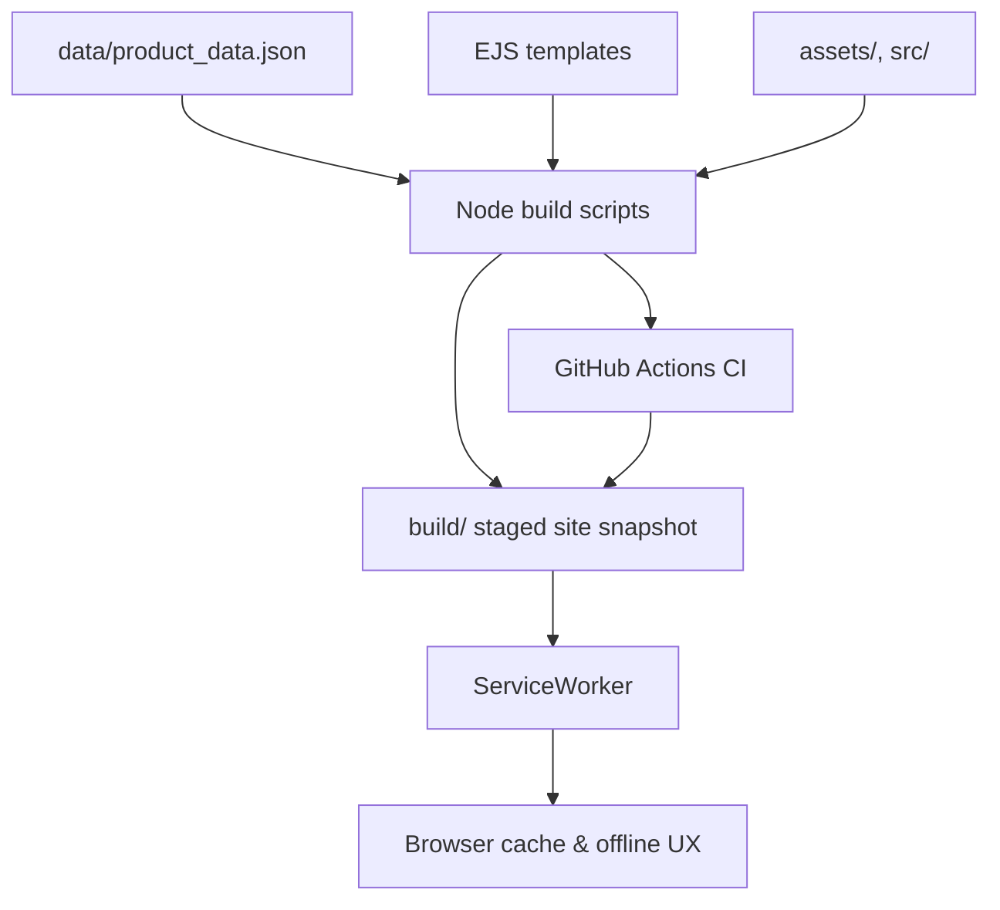

# El Rincón de Ébano – Offline-first catalog with disciplined automation

Providing a bilingual-friendly grocery catalog that ships as a static site, pre-caches critical assets, and keeps operations reproducible through scripted builds.

   

## Features

- Generate static category, product, and offline pages from EJS templates plus structured JSON data (`tools/build*.js`).
- Ship an offline-first service worker with cache expiry controls and message channels for deterministic hydration fallbacks.
- Orchestrate responsive AVIF/WebP asset pipelines with Sharp and automated GitHub Actions image rewrites.
- Inject schema.org structured data, preload hints, and robots metadata as part of the deterministic build chain.
- Exercise multiple layers of verification: node:test suites, Playwright anti-flicker checks, Cypress menu regression, and stylesheet order linting.
- Maintain reproducible operations with Volta-pinned runtime, npm lockfile, and backup pruning scripts for catalog data.
- Ship an optional desktop “Content Manager” (`admin/product_manager/`) that edits `data/product_data.json` locally; remote API sync is disabled by default so changes are committed through Git.

> ```js
> // service-worker.js
> const CACHE_CONFIG = {
>   prefixes: {
>     static: 'ebano-static-v6',
>     dynamic: 'ebano-dynamic-v4',
>     products: 'ebano-products-v5',
>   },
> };
> // Versioned prefixes make cache busting explicit, avoiding stale assets after data refreshes.
> ```

### Cache versioning guide

Use explicit cache prefix bumps to force refreshes in the service worker. The
prefixes live in `service-worker.js` under `CACHE_CONFIG.prefixes`.

**Cache prefix configuration**

| Name | Type | Default | Required | Description |
| ---- | ---- | ------- | -------- | ----------- |
| `prefixes.static` | string | `ebano-static-v6` | ✅ | Precached assets such as CSS, JS, icons, fonts, and offline pages. |
| `prefixes.dynamic` | string | `ebano-dynamic-v4` | ✅ | Runtime cache for HTML fetches and dynamic endpoints outside precache. |
| `prefixes.products` | string | `ebano-products-v5` | ✅ | Product data cache (JSON) and catalog refresh logic. |

**When to bump**

- **ebano-static:** changes to CSS/JS bundles, icon sets, offline pages, or any
  precached assets list.
- **ebano-dynamic:** cache strategy changes or new runtime endpoints.
- **ebano-products:** data schema changes, catalog invalidation logic, or data
  refreshes that must bypass old JSON.

**Examples**

- Data changes (prices, stock, product list) → bump `ebano-products`.
- CSS/JS changes (new styles, UI scripts) → bump `ebano-static`.

## Stack Used

- **Languages & templates:** HTML, CSS, JavaScript (ES modules), and EJS templates.
- **Runtime:** Node.js 22.x (Volta + `.nvmrc` guardrails). Admin Tools run on Python 3.12.
- **UI framework:** Bootstrap 5 with vanilla JS modules and service worker orchestration.
- **Build tooling:** Custom Node scripts with esbuild, Sharp, undici, and Lighthouse.
- **Testing:** node:test, Vitest, Playwright, Cypress, CSS order lint, Lighthouse audits in CI.
- **Automation:** GitHub Actions for CI, Pages deploy, image optimization, and Codacy SARIF upload.

## Architecture at a Glance



## Quick Start

1. `nvm use 22` – align with the Volta/CI runtime (`>=22 <25`).
2. `npm ci` – install dependencies deterministically.
3. `npm run build` – generate a full static snapshot under `build/` (contains `dist/`, `pages/`, sitemap, etc.).
4. `npx serve build -l 4173` – preview the staged site locally (swap with your preferred static server).

See `docs/onboarding/LOCAL_DEV.md` for local flags, admin tooling, and preview options.

_No environment variables are required for the default build. The admin panel is excluded by default; set `INCLUDE_ADMIN_PANEL=1` to include it in the build. Optional flags such as `FULL_REGEN` or `LH_SKIP_BUILD` fine-tune heavy scripts and are documented inline in `tools/`._

## Language behavior

- **Supported languages today:** Spanish-only content is shipped. Any bilingual support is
  **aspirational** and should not be treated as a guaranteed feature yet.
- **Default language:** Spanish (`es`) is the default for rendered pages (see `lang="es"` in
  `templates/index.ejs` and `templates/category.ejs`).
- **Fallback rules:** there is no runtime language negotiation. If future translations are
  added, the expected fallback remains Spanish.
- **Where strings live:** localized copy currently lives directly in EJS templates
  (`templates/`) and product/category labels in `data/product_data.json`.

## Category Taxonomy

Canonical taxonomy contract:

- Registry source: `data/category_registry.json` (identity + presentation metadata).
- Legacy compatibility catalog: `data/categories.json` (used by existing tooling and CM views).
- Product assignments: `data/product_data.json` uses category `key` values (legacy `product_key`).

Current category keys in product data:

- Aguas
- Bebidas
- Carnesyembutidos
- Cervezas
- Chocolates
- Despensa
- Energeticaseisotonicas
- Espumantes
- Juegos
- Jugos
- Lacteos
- Limpiezayaseo
- Llaveros
- Mascotas
- Piscos
- SnacksDulces
- SnacksSalados
- Vinos

**Rules**

- Keep category identity stable (`id`, `key`, `slug`) unless a migration plan exists.
- `display_name` and `nav_group` can change safely after contract checks.
- Validate contract changes with `npm run validate:categories`.
- New categories must be reflected in `data/category_registry.json` and validated before build/release.

## Pricing & Discounts

- **Currency:** prices are stored and rendered in Chilean pesos (CLP).
- **Integer vs decimals:** prices and discounts are integers only (no decimals); any intermediate math must end as a whole CLP value.
- **Rounding rule:** when calculations produce fractional values, round half up to 0 decimals before display/storage.
- **Locale formatting:** use Chilean formatting (thousands separator `.` and decimal symbol `,`), displayed as `CLP 4.000`.
- **Discount semantics:** `discount` is an absolute CLP amount (not a percentage) subtracted from `price`.
- **Discount display impact:** when discounted, show the final price as primary and the original price struck through, plus a derived percentage badge; otherwise show the base price only.

Example (CLP amounts, absolute discount):

```json
{
  "price": 5000,
  "discount": 1000
}
```

This yields a displayed final price of `CLP 4.000`, with the original `CLP 5.000` struck through and a derived `20%` badge.

## Size normalization (product data)

To keep catalog sizing consistent across the site and Content Manager exports, products
carry normalized size fields. Normalize source strings like `1Kg` or `1 L` to base units.

**Base units by category**

| Category group (data/product_data.json) | Base unit |
| --------------------------------------- | --------- |
| Aguas, Bebidas, Cervezas, Jugos, Piscos, Vinos, Espumantes, Energeticaseisotonicas | `ml` |
| Carnesyembutidos, Chocolates, Despensa, Lacteos, SnacksDulces, SnacksSalados | `g` |
| Juegos, Llaveros, Mascotas, Limpiezayaseo | `unit` |

**Minimal size schema**

| Name | Type | Default | Required | Description |
| ---- | ---- | ------- | -------- | ----------- |
| `size_value` | number | `null` | ✅ | Numeric amount expressed in the base unit for the product category. |
| `size_unit` | string | `null` | ✅ | Normalized unit: `g`, `ml`, or `unit`. |
| `size_display` | string | `null` | ❌ | Optional human-readable label (e.g., `1Kg`, `2 x 350 ml`). |

**Normalization examples**

- `1Kg` → `size_value: 1000`, `size_unit: "g"`, `size_display: "1Kg"`.
- `1 L` → `size_value: 1000`, `size_unit: "ml"`, `size_display: "1 L"`.
- `Pack x2` → `size_value: 2`, `size_unit: "unit"`, `size_display: "Pack x2"`.

**Display rule**

- If `size_display` is present, render it as-is.
- Otherwise render `${size_value} ${size_unit}` using the normalized fields.

## Availability

- **Stock flag:** set `stock: false` in `data/product_data.json` to mark a product as unavailable.
- **Visual treatment:** the card receives the `agotado` class, which applies a dark overlay
  badge labeled **"AGOTADO"** and grayscales the product image (`assets/css/style.css`,
  `assets/css/style-enhanced.css`).
- **Catalog filtering:** client-side filtering/search excludes out-of-stock items, so
  filtered views hide products with `stock: false` even though the base catalog can still
  render them.

## Catalog data fetch UX policy

When `/data/product_data.json` cannot be fetched, the UI follows a strict fallback order:

1. **Last cached full catalog (preferred):** if the service worker cache has a copy of
   `product_data.json`, the UI renders the last cached full catalog with no blocking error.
2. **Inline subset (partial):** if cached data is unavailable but the inline catalog exists,
   the UI renders only that subset. Missing items are hidden (no placeholders).
3. **Error state:** if neither cached nor inline data is available, the UI shows the error
   message:
   `Error al cargar los productos. Por favor, verifique su conexión a internet e inténtelo de nuevo.`
   and includes an **"Intentar nuevamente"** retry button.

Operational recovery steps for this policy live in
[`docs/operations/RUNBOOK.md`](docs/operations/RUNBOOK.md).

### Product image workflow (WebP + AVIF)

- Every catalog entry still needs a traditional fallback image (`image_path`) in `assets/images/` using one of the existing extensions (`.png`, `.jpg`, `.jpeg`, `.gif`, `.webp`).
- AVIF assets are now optional but supported through a new `image_avif_path` field stored alongside products in `data/product_data.json`.
- Image variants are generated from `assets/images/originals/` into `assets/images/variants/` by the image pipeline.
- `tools/generate-image-variants.js` reads `data/product_data.json` by default; override with `PRODUCTS_JSON=/path/to/product_data.json` when needed.
- The Node build emits `<picture>` tags and serves AVIF when browsers advertise support, while preserving the WebP/JPEG fallback for Safari/legacy clients.
- Offline Product Manager and the admin panel expose new fields so you can paste the AVIF relative path (e.g. `assets/images/bebidas/Coca.webp` + `assets/images/bebidas/Coca.avif`). The dialog also offers a helper button to copy AVIF files into the canonical assets directory.
- Keep both files committed and run `npm run build` after changes; the guard workflow simply rebuilds from source and fails if the staged output diverges.

## Quality & Tests

| Check                 | Command                    | Notes                                                         |
| --------------------- | -------------------------- | ------------------------------------------------------------- |
| Unit tests            | `npm test`                 | Runs node:test plus Vitest; includes service worker runtime coverage. |
| Coverage              | `npm run test:coverage`    | Generates `coverage/` via c8 for local review.               |
| Admin Tool tests      | `pytest`                   | 100% coverage for Admin logic (18 tests).                     |
| CSS entrypoint order  | `npm run check:css-order`  | Guards against regressions in `<link>` ordering.              |
| Playwright regression | `npm run test:e2e`         | Validates navbar/cart flicker budgets (CI installs Chromium). |
| Cypress smoke         | `npm run test:cypress`     | Ensures navigation menu parity with production templates.     |
| Lint                  | `npx eslint .`             | Enforces repo-wide JS/TS standards.                           |
| Typecheck             | `npm run typecheck`        | Runs `tsc -p tsconfig.typecheck.json` for JS/TS contract drift. |
| Lighthouse audit      | `npm run lighthouse:audit` | Reuses last build via `LH_SKIP_BUILD=1` in CI.                |

_Coverage reporting is instrumented via `c8`; publish thresholds or badges once you agree on targets._

## Performance & Accessibility

- Lighthouse script runs against both desktop and mobile profiles; results land in `reports/lighthouse/` for traceability.
- Service worker caches HTML, assets, and product data with expiry metadata to keep INP budgets in check while avoiding stale catalog listings.
- Image workflows generate AVIF/WebP plus fallbacks, reducing payloads before pages reach GitHub Pages.

## CI Guardrails

- Run `npm run ci:guardrails` before risky changes.
- See `docs/RELEASE.md` and `docs/INCIDENTS.md` for release + incident flow.

## Roadmap

- Publish `LICENSE` file matching the ISC declaration for distribution clarity.
- Add coverage thresholds and surface results in CI badges.
- Automate visual diffing from the existing Playwright suite to guard marketing-critical pages.
- Document the Python → Node data sync between `admin/` scripts and `data/product_data.json` for future contributors.
- Introduce scheduled build snapshots that archive `pages/` outputs for release notes.

## Why It Matters

- Demonstrates ownership of an offline-first UX with cache versioning and graceful degradation, reflecting production-readiness for PWA work.
- Shows ability to codify operational tasks (fonts, icons, sitemap, backups) as idempotent scripts rather than wiki steps.
- Validates quality gates across layers (unit, e2e, accessibility) similar to what I enforce in regulated delivery pipelines.
- Highlights CI discipline with pinned Node versions, npm caching, and reproducible builds for deterministic deploys.
- Emphasizes maintainability through documented scripts, Volta pinning, and automation-first image management.

## Contributing & License

Contributions via pull request are welcome — please run the CI suite (`npm run build`, `npm run lint`, `npm run typecheck`, `npm test`, `npm run check:css-order`, `npm run test:e2e`) before submitting. The project is licensed under ISC as declared in `package.json`; add a root `LICENSE` file before publishing externally.

## Operational Runbooks

- [Documentation index](docs/README.md) — entry point for operations, architecture, and audit docs.
- [Repository structure and conventions](docs/repo/STRUCTURE.md) — canonical folder map, naming, and import rules.
- [Service worker + data recovery runbook](docs/operations/RUNBOOK.md) — canonical operational procedures for cache busting, incident response, and data refreshes.
- [Backup management checklist](docs/operations/BACKUP.md) — retention policies and restoration steps for catalog data snapshots.

## Contact & Portfolio

- GitHub: [Repository owner](../../..)
- Issues: [Open a new discussion](../../issues/new/choose)
- Portfolio / LinkedIn: _Add personal links here before sharing with employers._

---

_Footnote:_ capture a Lighthouse report (`npm run lighthouse:audit`) and store it under `docs/` when preparing for review sessions.
