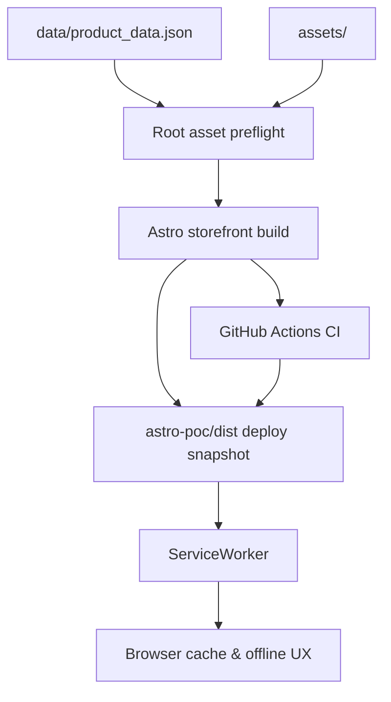

# El Rincón de Ébano – Offline-first catalog with disciplined automation

Providing a bilingual-friendly grocery catalog that ships as a static site, pre-caches critical assets, and keeps operations reproducible through scripted builds.

   

## Current Project State

- The public website at `https://elrincondeebano.com/` is currently served from the Astro storefront in [`astro-poc/`](astro-poc/).
- The legacy Node + EJS static build at the repo root is archived as a historical reference only; it is no longer part of the active build, CI, or deploy path. See [`docs/archive/LEGACY_STOREFRONT.md`](docs/archive/LEGACY_STOREFRONT.md).
- [`preview.html`](preview.html) is a local/demo artifact only. It is not part of the production deployment contract.
- Product data and most static assets are still shared from the root-level [`data/`](data/) and [`assets/`](assets/) directories.
- For user-facing storefront fixes, validate Astro through the root commands (`npm run build`, `npm run test:e2e`).

## Features

- Build the active Astro storefront from shared product data, category metadata, and public assets.
- Ship an offline-first service worker with cache expiry controls and message channels for deterministic hydration fallbacks.
- Orchestrate responsive AVIF/WebP asset pipelines with Sharp and automated GitHub Actions image rewrites.
- Inject schema.org structured data, preload hints, and robots metadata as part of the deterministic build chain.
- Promote category-specific WhatsApp/Open Graph JPGs from manual source images in `imagenes/` into the tracked OG pipeline under `assets/images/og/categories/`.
- Exercise multiple layers of verification: node:test suites, Playwright Astro regression checks, Cypress menu regression, and Lighthouse audits.
- Maintain reproducible operations with Volta-pinned runtime, npm lockfile, and backup pruning scripts for catalog data.
- Ship an optional desktop “Content Manager” (`admin/product_manager/`) that edits `data/product_data.json` locally; remote API sync is disabled by default so changes are committed through Git.

> ```js
> // service-worker.js
> const CACHE_CONFIG = {
>   prefixes: {
>     static: 'ebano-static-v6',
>     dynamic: 'ebano-dynamic-v4',
>     products: 'ebano-products-v5',
>   },
> };
> // Versioned prefixes make cache busting explicit, avoiding stale assets after data refreshes.
> ```

### Cache versioning guide

Use explicit cache prefix bumps to force refreshes in the service worker. The
prefixes live in `service-worker.js` under `CACHE_CONFIG.prefixes`.

**Cache prefix configuration**

| Name                | Type   | Default             | Required | Description                                                            |
| ------------------- | ------ | ------------------- | -------- | ---------------------------------------------------------------------- |
| `prefixes.static`   | string | `ebano-static-v6`   | ✅       | Precached assets such as CSS, JS, icons, fonts, and offline pages.     |
| `prefixes.dynamic`  | string | `ebano-dynamic-v4`  | ✅       | Runtime cache for HTML fetches and dynamic endpoints outside precache. |
| `prefixes.products` | string | `ebano-products-v5` | ✅       | Product data cache (JSON) and catalog refresh logic.                   |

**When to bump**

- **ebano-static:** changes to CSS/JS bundles, icon sets, offline pages, or any
  precached assets list.
- **ebano-dynamic:** cache strategy changes or new runtime endpoints.
- **ebano-products:** data schema changes, catalog invalidation logic, or data
  refreshes that must bypass old JSON.
  Your repository details have been saved.
  
  elrincondeebano
  Public
  Pin
  
  Unwatch1
  Fork 0
   Star 0
  cortega26/elrincondeebano
  
  main
  1 Branch
  3 Tags
  
  t
  Add file
  Add file
  
  Code
  Folders and files
  Name
  Latest commit
  
  cortega26
  Merge pull request #257 from cortega26/dependabot/npm_and_yarn/astro-…
  
  
  70c3a9e
  ·
  22 minutes ago
  History
  1,753 Commits
  .github
  ci: auto-commit synced files on dependabot PRs to prevent failing rep…
  25 minutes ago
  admin-panel
  chore: update optimized images
  3 months ago
  admin
  chore(py-deps): bump the pip-patch-minor group
  5 days ago
  assets
  Move hero text up
  last week
  astro-poc
  chore(deps): bump h3
  1 hour ago
  config
  OG image update
  last month
  cypress
  feat: deferred CSS, stricter CI, and expanded docs/testsfeat: deferre…
  last month
  data
  fix(ci): commit synced data/public files to fix Astro build check
  31 minutes ago
  docs
  docs(audit): close edge hardening backlog
  2 weeks ago
  imagenes
  WhatsApp OG
  2 weeks ago
  infra/cloudflare/edge-security-headers
  fix(ci): satisfy codacy worker check
  last week
  reports
  chore: update optimized images
  3 months ago
  scripts
  fix(ci): harden deploy path and replace codacy
  2 weeks ago
  server
  Fixed syncing issues around Content Manager
  2 weeks ago
  src/js
  Updated cerveza OG img
  2 weeks ago
  static
  audit(remediation): close repo-only migration backlog
  2 weeks ago
  test
  Changed the slug
  last week
  tools
  Changed the slug
  last week
  .codacy.yml
  Updated Codacy.html to remove false positive
  3 months ago
  .eslintrc.json
  feat: Introduce comprehensive testing, documentation, build tools, CI…
  3 months ago
  .gitignore
  fix(ci): restore main deploy chain
  2 weeks ago
  .node-version
  chore(node): align toolchain on node 22
  5 months ago
  .nvmrc
  chore(node): align toolchain on node 22
  5 months ago
  .prettierrc
  feat: Introduce comprehensive testing, documentation, build tools, CI…
  3 months ago
  .semgrepignore
  fix(ci): harden deploy path and replace codacy
  2 weeks ago
  .tool-versions
  chore(node): align toolchain on node 22
  5 months ago
  404.html
  More tech debt
  2 weeks ago
  AGENTS.md
  feat(audit): add edge header gates and category og sync
  2 weeks ago
  CHANGELOG.md
  Update CHANGELOG.md with new release notes and version history
  3 months ago
  CI_COMPAT.md
  docs(audit): refresh migration readiness evidence and decisions
  last month
  CONTENT_MANAGER_COMPAT.md
  audit(remediation): close repo-only migration backlog
  2 weeks ago
  CONTRACTS.md
  Retiro de deploy legado
  2 weeks ago
  GEMINI.md
  feat: Introduce comprehensive testing, documentation, build tools, CI…
  3 months ago
  MIGRATION_COVERAGE_MATRIX.md
  docs(audit): refresh migration readiness evidence and decisions
  last month
  MIGRATION_DONE.md
  Merge pull request #227 from cortega26/hardening/post-cutover-stabili…
  last month
  MIGRATION_READY.md
  docs(audit): pin readiness evidence to latest green workflow set
  last month
  README.md
  feat(audit): add edge header gates and category og sync
  2 weeks ago
  RUNBOOK_MIGRATION_ASTRO.md
  Se finaliza migración a Astro y se deja EJS en legady archivado ofici…
  2 weeks ago
  SMOKE_RESULTS.md
  docs(audit): refresh migration readiness evidence and decisions
  last month
  app.webmanifest
  `Updated website content and styles to reflect changes in minimarket …
2 weeks ago
cypress.config.ts
fix(nav): unify menu controller and regression tests
5 months ago
eslint.config.cjs
feat: deferred CSS, stricter CI, and expanded docs/testsfeat: deferre…
last month
mypy.ini
`Added type hints and annotations to various files in the admin/produ…
  2 months ago
  package-lock.json
  chore(deps): bump flatted from 3.3.3 to 3.4.2
  yesterday
  package.json
  Merge pull request #254 from cortega26/dependabot/npm_and_yarn/npm-pa…
  5 days ago
  playwright.astro.config.ts
  Se finaliza migración a Astro y se deja EJS en legady archivado ofici…
  2 weeks ago
  playwright.config.ts
  Se finaliza migración a Astro y se deja EJS en legady archivado ofici…
  2 weeks ago
  preview.html
  preview
  2 weeks ago
  robots.txt
  fix(ci): commit synced data/public files to fix Astro build check
  31 minutes ago
  service-worker.js
  audit(remediation): close repo-only migration backlog
  2 weeks ago
  stryker.conf.mjs
  feat: Introduce comprehensive testing, documentation, build tools, CI…
  3 months ago
  tsconfig.json
  feat: Introduce comprehensive testing, documentation, build tools, CI…
  3 months ago
  tsconfig.typecheck.json
  Typecheck updates
  last month
  vitest.config.mts
  test(migration): add astro parity smoke and canary contract checks
  last month
  Repository files navigation
  README
  
  
  El Rincón de Ébano – Offline-first catalog with disciplined automation
  Providing a bilingual-friendly grocery catalog that ships as a static site, pre-caches critical assets, and keeps operations reproducible through scripted builds.

   

Current Project State
The public website at https://www.elrincondeebano.com/ is currently served from the Astro storefront in astro-poc/.
The legacy Node + EJS static build at the repo root is archived as a historical reference only; it is no longer part of the active build, CI, or deploy path. See docs/archive/LEGACY_STOREFRONT.md.
preview.html is a local/demo artifact only. It is not part of the production deployment contract.
Product data and most static assets are still shared from the root-level data/ and assets/ directories.
For user-facing storefront fixes, validate Astro through the root commands (npm run build, npm run test:e2e).
Features
Build the active Astro storefront from shared product data, category metadata, and public assets.
Ship an offline-first service worker with cache expiry controls and message channels for deterministic hydration fallbacks.
Orchestrate responsive AVIF/WebP asset pipelines with Sharp and automated GitHub Actions image rewrites.
Inject schema.org structured data, preload hints, and robots metadata as part of the deterministic build chain.
Promote category-specific WhatsApp/Open Graph JPGs from manual source images in imagenes/ into the tracked OG pipeline under assets/images/og/categories/.
Exercise multiple layers of verification: node:test suites, Playwright Astro regression checks, Cypress menu regression, and Lighthouse audits.
Maintain reproducible operations with Volta-pinned runtime, npm lockfile, and backup pruning scripts for catalog data.
Ship an optional desktop “Content Manager” (admin/product_manager/) that edits data/product_data.json locally; remote API sync is disabled by default so changes are committed through Git.
// service-worker.js
const CACHE_CONFIG = {
prefixes: {
static: 'ebano-static-v6',
dynamic: 'ebano-dynamic-v4',
products: 'ebano-products-v5',
},
};
// Versioned prefixes make cache busting explicit, avoiding stale assets after data refreshes.
Cache versioning guide
Use explicit cache prefix bumps to force refreshes in the service worker. The prefixes live in service-worker.js under CACHE_CONFIG.prefixes.

Cache prefix configuration

Name Type Default Required Description
prefixes.static string ebano-static-v6 ✅ Precached assets such as CSS, JS, icons, fonts, and offline pages.
prefixes.dynamic string ebano-dynamic-v4 ✅ Runtime cache for HTML fetches and dynamic endpoints outside precache.
prefixes.products string ebano-products-v5 ✅ Product data cache (JSON) and catalog refresh logic.
When to bump

ebano-static: changes to CSS/JS bundles, icon sets, offline pages, or any precached assets list.
ebano-dynamic: cache strategy changes or new runtime endpoints.
ebano-products: data schema changes, catalog invalidation logic, or data refreshes that must bypass old JSON.
Examples

Data changes (prices, stock, product list) → bump ebano-products.
CSS/JS changes (new styles, UI scripts) → bump ebano-static.
Stack Used
Languages & templates: HTML, CSS, JavaScript (ES modules), and EJS templates.
Runtime: Node.js 22.x (Volta + .nvmrc guardrails). Admin Tools run on Python 3.12.
UI framework: Bootstrap 5 with vanilla JS modules and service worker orchestration.
Build tooling: Custom Node scripts with esbuild, Sharp, undici, and Lighthouse.
Testing: node:test, Vitest, Playwright, Cypress, CSS order lint, Lighthouse audits in CI.
Automation: GitHub Actions for CI, Pages deploy, image optimization, and Codacy SARIF upload.
Edge hardening contract: the expected production security-header baseline is documented in docs/operations/EDGE_SECURITY_HEADERS.md and probed by the live contract monitor/canary workflows.
Architecture at a Glance

Quick Start
nvm use 22 – align with the Volta/CI runtime (>=22 <25).
npm ci – install dependencies deterministically.
npm run build – build the active Astro storefront plus shared asset preflight.
npx serve astro-poc/dist -l 4174 – preview the Astro storefront locally.
npm run test:e2e – run the active Astro Playwright suite.
There is no second storefront build path in active use; npm run build is the canonical production build.
See docs/onboarding/LOCAL_DEV.md for local flags, admin tooling, and preview options.

No environment variables are required for the default build. The admin panel is excluded by default; set INCLUDE_ADMIN_PANEL=1 to include it in the build. Optional flags such as FULL_REGEN or LH_SKIP_BUILD fine-tune heavy scripts and are documented inline in tools/.

Language behavior
Supported languages today: Spanish-only content is shipped. Any bilingual support is aspirational and should not be treated as a guaranteed feature yet.
Default language: Spanish (es) is the default for rendered pages (see lang="es" in the Astro output under astro-poc/src/pages/**).
Fallback rules: there is no runtime language negotiation. If future translations are added, the expected fallback remains Spanish.
Where strings live: localized copy for the active storefront lives in Astro components/pages under astro-poc/src/**, while product/category labels live in data/product_data.json.
Category Taxonomy
Canonical taxonomy contract:

Registry source: data/category_registry.json (identity + presentation metadata).
Legacy compatibility catalog: data/categories.json (used by existing tooling and CM views).
Product assignments: data/product_data.json uses category key values (legacy product_key).
Current category keys in product data:

Aguas
Bebidas
Carnesyembutidos
Cervezas
Chocolates
Despensa
Energeticaseisotonicas
Espumantes
Juegos
Jugos
Lacteos
Limpiezayaseo
Llaveros
Mascotas
Piscos
SnacksDulces
SnacksSalados
Vinos
Rules

Keep category identity stable (id, key, slug) unless a migration plan exists.
display_name and nav_group can change safely after contract checks.
Validate contract changes with npm run validate:categories.
New categories must be reflected in data/category_registry.json and validated before build/release.
Pricing & Discounts
Currency: prices are stored and rendered in Chilean pesos (CLP).
Integer vs decimals: prices and discounts are integers only (no decimals); any intermediate math must end as a whole CLP value.
Rounding rule: when calculations produce fractional values, round half up to 0 decimals before display/storage.
Locale formatting: use Chilean formatting (thousands separator . and decimal symbol ,), displayed as CLP 4.000.
Discount semantics: discount is an absolute CLP amount (not a percentage) subtracted from price.
Discount display impact: when discounted, show the final price as primary and the original price struck through, plus a derived percentage badge; otherwise show the base price only.
Example (CLP amounts, absolute discount):

{
"price": 5000,
"discount": 1000
}
This yields a displayed final price of CLP 4.000, with the original CLP 5.000 struck through and a derived 20% badge.

Size normalization (product data)
To keep catalog sizing consistent across the site and Content Manager exports, products carry normalized size fields. Normalize source strings like 1Kg or 1 L to base units.

Base units by category

Category group (data/product_data.json) Base unit
Aguas, Bebidas, Cervezas, Jugos, Piscos, Vinos, Espumantes, Energeticaseisotonicas ml
Carnesyembutidos, Chocolates, Despensa, Lacteos, SnacksDulces, SnacksSalados g
Juegos, Llaveros, Mascotas, Limpiezayaseo unit
Minimal size schema

Name Type Default Required Description
size_value number null ✅ Numeric amount expressed in the base unit for the product category.
size_unit string null ✅ Normalized unit: g, ml, or unit.
size_display string null ❌ Optional human-readable label (e.g., 1Kg, 2 x 350 ml).
Normalization examples

1Kg → size_value: 1000, size_unit: "g", size_display: "1Kg".
1 L → size_value: 1000, size_unit: "ml", size_display: "1 L".
Pack x2 → size_value: 2, size_unit: "unit", size_display: "Pack x2".
Display rule

If size_display is present, render it as-is.
Otherwise render ${size_value} ${size_unit} using the normalized fields.
Availability
Stock flag: set stock: false in data/product_data.json to mark a product as unavailable.
Visual treatment: the card receives the agotado class, which applies a dark overlay badge labeled "AGOTADO" and grayscales the product image (assets/css/style.css, assets/css/style-enhanced.css).
Catalog filtering: client-side filtering/search excludes out-of-stock items, so filtered views hide products with stock: false even though the base catalog can still render them.
Catalog data fetch UX policy
When /data/product_data.json cannot be fetched, the UI follows a strict fallback order:

Last cached full catalog (preferred): if the service worker cache has a copy of product_data.json, the UI renders the last cached full catalog with no blocking error.
Inline subset (partial): if cached data is unavailable but the inline catalog exists, the UI renders only that subset. Missing items are hidden (no placeholders).
Error state: if neither cached nor inline data is available, the UI shows the error message: Error al cargar los productos. Por favor, verifique su conexión a internet e inténtelo de nuevo. and includes an "Intentar nuevamente" retry button.
Operational recovery steps for this policy live in docs/operations/RUNBOOK.md.

Product image workflow (WebP + AVIF)
Every catalog entry still needs a traditional fallback image (image_path) in assets/images/ using one of the existing extensions (.png, .jpg, .jpeg, .gif, .webp).
AVIF assets are now optional but supported through a new image_avif_path field stored alongside products in data/product_data.json.
Image variants are generated from assets/images/originals/ into assets/images/variants/ by the image pipeline.
tools/generate-image-variants.js reads data/product_data.json by default; override with PRODUCTS_JSON=/path/to/product_data.json when needed.
The active storefront emits <picture> tags and serves AVIF when browsers advertise support, while preserving the WebP/JPEG fallback for Safari/legacy clients.
Offline Product Manager and the admin panel expose new fields so you can paste the AVIF relative path (e.g. assets/images/bebidas/Coca.webp + assets/images/bebidas/Coca.avif). The dialog also offers a helper button to copy AVIF files into the canonical assets directory.
Keep both files committed and run npm run build after changes; the active guard workflow rebuilds the Astro storefront from source and validates the artifact contract.
Quality & Tests
Check Command Notes
Unit tests npm test Runs node:test plus Vitest; includes service worker runtime coverage.
Coverage npm run test:coverage Generates coverage/ via c8 for local review.
Admin Tool tests pytest 100% coverage for Admin logic (18 tests).
Playwright regression npm run test:e2e Validates navbar/cart flicker budgets (CI installs Chromium).
Cypress smoke npm run test:cypress Ensures navigation menu parity with production templates.
Lint npx eslint . Enforces repo-wide JS/TS standards.
Typecheck npm run typecheck Runs tsc -p tsconfig.typecheck.json for JS/TS contract drift.
Lighthouse audit npm run lighthouse:audit Reuses last build via LH_SKIP_BUILD=1 in CI.
Coverage reporting is instrumented via c8; publish thresholds or badges once you agree on targets.

Performance & Accessibility
Lighthouse script runs against both desktop and mobile profiles; results land in reports/lighthouse/ for traceability.
Service worker caches HTML, assets, and product data with expiry metadata to keep INP budgets in check while avoiding stale catalog listings.
Image workflows generate AVIF/WebP plus fallbacks, reducing payloads before pages reach GitHub Pages.
CI Guardrails
Run npm run ci:guardrails before risky changes.
See docs/RELEASE.md and docs/INCIDENTS.md for release + incident flow.
Roadmap
Publish LICENSE file matching the ISC declaration for distribution clarity.
Add coverage thresholds and surface results in CI badges.
Automate visual diffing from the existing Playwright suite to guard marketing-critical pages.
Document the Python → Node data sync between admin/ scripts and data/product_data.json for future contributors.
Introduce scheduled build snapshots that archive pages/ outputs for release notes.
Why It Matters
Demonstrates ownership of an offline-first UX with cache versioning and graceful degradation, reflecting production-readiness for PWA work.
Shows ability to codify operational tasks (fonts, icons, sitemap, backups) as idempotent scripts rather than wiki steps.
Validates quality gates across layers (unit, e2e, accessibility) similar to what I enforce in regulated delivery pipelines.
Highlights CI discipline with pinned Node versions, npm caching, and reproducible builds for deterministic deploys.
Emphasizes maintainability through documented scripts, Volta pinning, and automation-first image management.
Contributing & License
Contributions via pull request are welcome — please run the CI suite (npm run build, npm run lint, npm run typecheck, npm test, npm run test:e2e) before submitting. The project is licensed under ISC as declared in package.json; add a root LICENSE file before publishing externally.

Operational Runbooks
Documentation index — entry point for operations, architecture, and audit docs.
Repository structure and conventions — canonical folder map, naming, and import rules.
Service worker + data recovery runbook — canonical operational procedures for cache busting, incident response, and data refreshes.
Backup management checklist — retention policies and restoration steps for catalog data snapshots.
Contact & Portfolio
GitHub: Repository owner
Issues: Open a new discussion
Portfolio / LinkedIn: Add personal links here before sharing with employers.
Footnote: capture a Lighthouse report (npm run lighthouse:audit) and store it under docs/ when preparing for review sessions.

About
Static ecommerce website (mock)

elrincondeebano.com
Topics
node astro e-commerce vite e-commerce-project e-commerce-website vitest
Resources
Readme
Activity
Stars
0 stars
Watchers
1 watching
Forks
0 forks
Releases 2
Site snapshot backup-20251230-0023
Latest
on Dec 30, 2025

- 1 release
  Deployments
  500+
  github-pages 22 minutes ago
- more deployments
  Contributors
  3
  
  cortega26 Carlos Ortega González
  
  dependabot[bot]
  
  github-actions[bot]
  Languages
  HTML
  60.9%

JavaScript
20.5%

Python
14.1%

CSS
2.3%

TypeScript
1.3%

Astro
0.9%

**Examples**

- Data changes (prices, stock, product list) → bump `ebano-products`.
- CSS/JS changes (new styles, UI scripts) → bump `ebano-static`.

## Stack Used

- **Languages & templates:** HTML, CSS, JavaScript (ES modules), and EJS templates.
- **Runtime:** Node.js 22.x (Volta + `.nvmrc` guardrails). Admin Tools run on Python 3.12.
- **UI framework:** Bootstrap 5 with vanilla JS modules and service worker orchestration.
- **Build tooling:** Custom Node scripts with esbuild, Sharp, undici, and Lighthouse.
- **Testing:** node:test, Vitest, Playwright, Cypress, CSS order lint, Lighthouse audits in CI.
- **Automation:** GitHub Actions for CI, Pages deploy, image optimization, and Codacy SARIF upload.
- **Edge hardening contract:** the expected production security-header baseline is documented in [`docs/operations/EDGE_SECURITY_HEADERS.md`](docs/operations/EDGE_SECURITY_HEADERS.md) and probed by the live contract monitor/canary workflows.

## Architecture at a Glance


```mermaid
flowchart TD
  Data[data/product_data.json] --> SharedPrep[Root asset preflight]
  Assets[assets/] --> SharedPrep
  SharedPrep --> AstroBuild[Astro storefront build]
  AstroBuild --> Staging[astro-poc/dist deploy snapshot]
  Staging --> ServiceWorker
  ServiceWorker --> Browser[Browser cache & offline UX]
  AstroBuild --> CI[GitHub Actions CI]
  CI --> Staging
```

## Quick Start

1. `nvm use 22` – align with the Volta/CI runtime (`>=22 <25`).
2. `npm ci` – install dependencies deterministically.
3. `npm run build` – build the active Astro storefront plus shared asset preflight.
4. `npx serve astro-poc/dist -l 4174` – preview the Astro storefront locally.
5. `npm run test:e2e` – run the active Astro Playwright suite.
6. There is no second storefront build path in active use; `npm run build` is the canonical production build.

See `docs/onboarding/LOCAL_DEV.md` for local flags, admin tooling, and preview options.

_No environment variables are required for the default build. The admin panel is excluded by default; set `INCLUDE_ADMIN_PANEL=1` to include it in the build. Optional flags such as `FULL_REGEN` or `LH_SKIP_BUILD` fine-tune heavy scripts and are documented inline in `tools/`._

## Language behaviorYour repository details have been saved.


elrincondeebano
Public
Pin

Unwatch1
Fork 0
 Star 0
cortega26/elrincondeebano

main
1 Branch
3 Tags

t
Add file
Add file

Code
Folders and files
Name
Latest commit

cortega26
Merge pull request #257 from cortega26/dependabot/npm_and_yarn/astro-…


70c3a9e
·
22 minutes ago
History
1,753 Commits
.github
ci: auto-commit synced files on dependabot PRs to prevent failing rep…
25 minutes ago
admin-panel
chore: update optimized images
3 months ago
admin
chore(py-deps): bump the pip-patch-minor group
5 days ago
assets
Move hero text up
last week
astro-poc
chore(deps): bump h3
1 hour ago
config
OG image update
last month
cypress
feat: deferred CSS, stricter CI, and expanded docs/testsfeat: deferre…
last month
data
fix(ci): commit synced data/public files to fix Astro build check
31 minutes ago
docs
docs(audit): close edge hardening backlog
2 weeks ago
imagenes
WhatsApp OG
2 weeks ago
infra/cloudflare/edge-security-headers
fix(ci): satisfy codacy worker check
last week
reports
chore: update optimized images
3 months ago
scripts
fix(ci): harden deploy path and replace codacy
2 weeks ago
server
Fixed syncing issues around Content Manager
2 weeks ago
src/js
Updated cerveza OG img
2 weeks ago
static
audit(remediation): close repo-only migration backlog
2 weeks ago
test
Changed the slug
last week
tools
Changed the slug
last week
.codacy.yml
Updated Codacy.html to remove false positive
3 months ago
.eslintrc.json
feat: Introduce comprehensive testing, documentation, build tools, CI…
3 months ago
.gitignore
fix(ci): restore main deploy chain
2 weeks ago
.node-version
chore(node): align toolchain on node 22
5 months ago
.nvmrc
chore(node): align toolchain on node 22
5 months ago
.prettierrc
feat: Introduce comprehensive testing, documentation, build tools, CI…
3 months ago
.semgrepignore
fix(ci): harden deploy path and replace codacy
2 weeks ago
.tool-versions
chore(node): align toolchain on node 22
5 months ago
404.html
More tech debt
2 weeks ago
AGENTS.md
feat(audit): add edge header gates and category og sync
2 weeks ago
CHANGELOG.md
Update CHANGELOG.md with new release notes and version history
3 months ago
CI_COMPAT.md
docs(audit): refresh migration readiness evidence and decisions
last month
CONTENT_MANAGER_COMPAT.md
audit(remediation): close repo-only migration backlog
2 weeks ago
CONTRACTS.md
Retiro de deploy legado
2 weeks ago
GEMINI.md
feat: Introduce comprehensive testing, documentation, build tools, CI…
3 months ago
MIGRATION_COVERAGE_MATRIX.md
docs(audit): refresh migration readiness evidence and decisions
last month
MIGRATION_DONE.md
Merge pull request #227 from cortega26/hardening/post-cutover-stabili…
last month
MIGRATION_READY.md
docs(audit): pin readiness evidence to latest green workflow set
last month
README.md
feat(audit): add edge header gates and category og sync
2 weeks ago
RUNBOOK_MIGRATION_ASTRO.md
Se finaliza migración a Astro y se deja EJS en legady archivado ofici…
2 weeks ago
SMOKE_RESULTS.md
docs(audit): refresh migration readiness evidence and decisions
last month
app.webmanifest
`Updated website content and styles to reflect changes in minimarket …
2 weeks ago
cypress.config.ts
fix(nav): unify menu controller and regression tests
5 months ago
eslint.config.cjs
feat: deferred CSS, stricter CI, and expanded docs/testsfeat: deferre…
last month
mypy.ini
`Added type hints and annotations to various files in the admin/produ…
2 months ago
package-lock.json
chore(deps): bump flatted from 3.3.3 to 3.4.2
yesterday
package.json
Merge pull request #254 from cortega26/dependabot/npm_and_yarn/npm-pa…
5 days ago
playwright.astro.config.ts
Se finaliza migración a Astro y se deja EJS en legady archivado ofici…
2 weeks ago
playwright.config.ts
Se finaliza migración a Astro y se deja EJS en legady archivado ofici…
2 weeks ago
preview.html
preview
2 weeks ago
robots.txt
fix(ci): commit synced data/public files to fix Astro build check
31 minutes ago
service-worker.js
audit(remediation): close repo-only migration backlog
2 weeks ago
stryker.conf.mjs
feat: Introduce comprehensive testing, documentation, build tools, CI…
3 months ago
tsconfig.json
feat: Introduce comprehensive testing, documentation, build tools, CI…
3 months ago
tsconfig.typecheck.json
Typecheck updates
last month
vitest.config.mts
test(migration): add astro parity smoke and canary contract checks
last month
Repository files navigation
README


El Rincón de Ébano – Offline-first catalog with disciplined automation
Providing a bilingual-friendly grocery catalog that ships as a static site, pre-caches critical assets, and keeps operations reproducible through scripted builds.

   

Current Project State
The public website at https://www.elrincondeebano.com/ is currently served from the Astro storefront in astro-poc/.
The legacy Node + EJS static build at the repo root is archived as a historical reference only; it is no longer part of the active build, CI, or deploy path. See docs/archive/LEGACY_STOREFRONT.md.
preview.html is a local/demo artifact only. It is not part of the production deployment contract.
Product data and most static assets are still shared from the root-level data/ and assets/ directories.
For user-facing storefront fixes, validate Astro through the root commands (npm run build, npm run test:e2e).
Features
Build the active Astro storefront from shared product data, category metadata, and public assets.
Ship an offline-first service worker with cache expiry controls and message channels for deterministic hydration fallbacks.
Orchestrate responsive AVIF/WebP asset pipelines with Sharp and automated GitHub Actions image rewrites.
Inject schema.org structured data, preload hints, and robots metadata as part of the deterministic build chain.
Promote category-specific WhatsApp/Open Graph JPGs from manual source images in imagenes/ into the tracked OG pipeline under assets/images/og/categories/.
Exercise multiple layers of verification: node:test suites, Playwright Astro regression checks, Cypress menu regression, and Lighthouse audits.
Maintain reproducible operations with Volta-pinned runtime, npm lockfile, and backup pruning scripts for catalog data.
Ship an optional desktop “Content Manager” (admin/product_manager/) that edits data/product_data.json locally; remote API sync is disabled by default so changes are committed through Git.
// service-worker.js
const CACHE_CONFIG = {
prefixes: {
static: 'ebano-static-v6',
dynamic: 'ebano-dynamic-v4',
products: 'ebano-products-v5',
},
};
// Versioned prefixes make cache busting explicit, avoiding stale assets after data refreshes.
Cache versioning guide
Use explicit cache prefix bumps to force refreshes in the service worker. The prefixes live in service-worker.js under CACHE_CONFIG.prefixes.

Cache prefix configuration

Name Type Default Required Description
prefixes.static string ebano-static-v6 ✅ Precached assets such as CSS, JS, icons, fonts, and offline pages.
prefixes.dynamic string ebano-dynamic-v4 ✅ Runtime cache for HTML fetches and dynamic endpoints outside precache.
prefixes.products string ebano-products-v5 ✅ Product data cache (JSON) and catalog refresh logic.
When to bump

ebano-static: changes to CSS/JS bundles, icon sets, offline pages, or any precached assets list.
ebano-dynamic: cache strategy changes or new runtime endpoints.
ebano-products: data schema changes, catalog invalidation logic, or data refreshes that must bypass old JSON.
Examples

Data changes (prices, stock, product list) → bump ebano-products.
CSS/JS changes (new styles, UI scripts) → bump ebano-static.
Stack Used
Languages & templates: HTML, CSS, JavaScript (ES modules), and EJS templates.
Runtime: Node.js 22.x (Volta + .nvmrc guardrails). Admin Tools run on Python 3.12.
UI framework: Bootstrap 5 with vanilla JS modules and service worker orchestration.
Build tooling: Custom Node scripts with esbuild, Sharp, undici, and Lighthouse.
Testing: node:test, Vitest, Playwright, Cypress, CSS order lint, Lighthouse audits in CI.
Automation: GitHub Actions for CI, Pages deploy, image optimization, and Codacy SARIF upload.
Edge hardening contract: the expected production security-header baseline is documented in docs/operations/EDGE_SECURITY_HEADERS.md and probed by the live contract monitor/canary workflows.
Architecture at a Glance

Quick Start
nvm use 22 – align with the Volta/CI runtime (>=22 <25).
npm ci – install dependencies deterministically.
npm run build – build the active Astro storefront plus shared asset preflight.
npx serve astro-poc/dist -l 4174 – preview the Astro storefront locally.
npm run test:e2e – run the active Astro Playwright suite.
There is no second storefront build path in active use; npm run build is the canonical production build.
See docs/onboarding/LOCAL_DEV.md for local flags, admin tooling, and preview options.

No environment variables are required for the default build. The admin panel is excluded by default; set INCLUDE_ADMIN_PANEL=1 to include it in the build. Optional flags such as FULL_REGEN or LH_SKIP_BUILD fine-tune heavy scripts and are documented inline in tools/.

Language behavior
Supported languages today: Spanish-only content is shipped. Any bilingual support is aspirational and should not be treated as a guaranteed feature yet.
Default language: Spanish (es) is the default for rendered pages (see lang="es" in the Astro output under astro-poc/src/pages/**).
Fallback rules: there is no runtime language negotiation. If future translations are added, the expected fallback remains Spanish.
Where strings live: localized copy for the active storefront lives in Astro components/pages under astro-poc/src/**, while product/category labels live in data/product_data.json.
Category Taxonomy
Canonical taxonomy contract:

Registry source: data/category_registry.json (identity + presentation metadata).
Legacy compatibility catalog: data/categories.json (used by existing tooling and CM views).
Product assignments: data/product_data.json uses category key values (legacy product_key).
Current category keys in product data:

Aguas
Bebidas
Carnesyembutidos
Cervezas
Chocolates
Despensa
Energeticaseisotonicas
Espumantes
Juegos
Jugos
Lacteos
Limpiezayaseo
Llaveros
Mascotas
Piscos
SnacksDulces
SnacksSalados
Vinos
Rules

Keep category identity stable (id, key, slug) unless a migration plan exists.
display_name and nav_group can change safely after contract checks.
Validate contract changes with npm run validate:categories.
New categories must be reflected in data/category_registry.json and validated before build/release.
Pricing & Discounts
Currency: prices are stored and rendered in Chilean pesos (CLP).
Integer vs decimals: prices and discounts are integers only (no decimals); any intermediate math must end as a whole CLP value.
Rounding rule: when calculations produce fractional values, round half up to 0 decimals before display/storage.
Locale formatting: use Chilean formatting (thousands separator . and decimal symbol ,), displayed as CLP 4.000.
Discount semantics: discount is an absolute CLP amount (not a percentage) subtracted from price.
Discount display impact: when discounted, show the final price as primary and the original price struck through, plus a derived percentage badge; otherwise show the base price only.
Example (CLP amounts, absolute discount):

{
"price": 5000,
"discount": 1000
}
This yields a displayed final price of CLP 4.000, with the original CLP 5.000 struck through and a derived 20% badge.

Size normalization (product data)
To keep catalog sizing consistent across the site and Content Manager exports, products carry normalized size fields. Normalize source strings like 1Kg or 1 L to base units.

Base units by category

Category group (data/product_data.json) Base unit
Aguas, Bebidas, Cervezas, Jugos, Piscos, Vinos, Espumantes, Energeticaseisotonicas ml
Carnesyembutidos, Chocolates, Despensa, Lacteos, SnacksDulces, SnacksSalados g
Juegos, Llaveros, Mascotas, Limpiezayaseo unit
Minimal size schema

Name Type Default Required Description
size_value number null ✅ Numeric amount expressed in the base unit for the product category.
size_unit string null ✅ Normalized unit: g, ml, or unit.
size_display string null ❌ Optional human-readable label (e.g., 1Kg, 2 x 350 ml).
Normalization examples

1Kg → size_value: 1000, size_unit: "g", size_display: "1Kg".
1 L → size_value: 1000, size_unit: "ml", size_display: "1 L".
Pack x2 → size_value: 2, size_unit: "unit", size_display: "Pack x2".
Display rule

If size_display is present, render it as-is.
Otherwise render ${size_value} ${size_unit} using the normalized fields.
Availability
Stock flag: set stock: false in data/product_data.json to mark a product as unavailable.
Visual treatment: the card receives the agotado class, which applies a dark overlay badge labeled "AGOTADO" and grayscales the product image (assets/css/style.css, assets/css/style-enhanced.css).
Catalog filtering: client-side filtering/search excludes out-of-stock items, so filtered views hide products with stock: false even though the base catalog can still render them.
Catalog data fetch UX policy
When /data/product_data.json cannot be fetched, the UI follows a strict fallback order:

Last cached full catalog (preferred): if the service worker cache has a copy of product_data.json, the UI renders the last cached full catalog with no blocking error.
Inline subset (partial): if cached data is unavailable but the inline catalog exists, the UI renders only that subset. Missing items are hidden (no placeholders).
Error state: if neither cached nor inline data is available, the UI shows the error message: Error al cargar los productos. Por favor, verifique su conexión a internet e inténtelo de nuevo. and includes an "Intentar nuevamente" retry button.
Operational recovery steps for this policy live in docs/operations/RUNBOOK.md.

Product image workflow (WebP + AVIF)
Every catalog entry still needs a traditional fallback image (image_path) in assets/images/ using one of the existing extensions (.png, .jpg, .jpeg, .gif, .webp).
AVIF assets are now optional but supported through a new image_avif_path field stored alongside products in data/product_data.json.
Image variants are generated from assets/images/originals/ into assets/images/variants/ by the image pipeline.
tools/generate-image-variants.js reads data/product_data.json by default; override with PRODUCTS_JSON=/path/to/product_data.json when needed.
The active storefront emits <picture> tags and serves AVIF when browsers advertise support, while preserving the WebP/JPEG fallback for Safari/legacy clients.
Offline Product Manager and the admin panel expose new fields so you can paste the AVIF relative path (e.g. assets/images/bebidas/Coca.webp + assets/images/bebidas/Coca.avif). The dialog also offers a helper button to copy AVIF files into the canonical assets directory.
Keep both files committed and run npm run build after changes; the active guard workflow rebuilds the Astro storefront from source and validates the artifact contract.
Quality & Tests
Check Command Notes
Unit tests npm test Runs node:test plus Vitest; includes service worker runtime coverage.
Coverage npm run test:coverage Generates coverage/ via c8 for local review.
Admin Tool tests pytest 100% coverage for Admin logic (18 tests).
Playwright regression npm run test:e2e Validates navbar/cart flicker budgets (CI installs Chromium).
Cypress smoke npm run test:cypress Ensures navigation menu parity with production templates.
Lint npx eslint . Enforces repo-wide JS/TS standards.
Typecheck npm run typecheck Runs tsc -p tsconfig.typecheck.json for JS/TS contract drift.
Lighthouse audit npm run lighthouse:audit Reuses last build via LH_SKIP_BUILD=1 in CI.
Coverage reporting is instrumented via c8; publish thresholds or badges once you agree on targets.

Performance & Accessibility
Lighthouse script runs against both desktop and mobile profiles; results land in reports/lighthouse/ for traceability.
Service worker caches HTML, assets, and product data with expiry metadata to keep INP budgets in check while avoiding stale catalog listings.
Image workflows generate AVIF/WebP plus fallbacks, reducing payloads before pages reach GitHub Pages.
CI Guardrails
Run npm run ci:guardrails before risky changes.
See docs/RELEASE.md and docs/INCIDENTS.md for release + incident flow.
Roadmap
Publish LICENSE file matching the ISC declaration for distribution clarity.
Add coverage thresholds and surface results in CI badges.
Automate visual diffing from the existing Playwright suite to guard marketing-critical pages.
Document the Python → Node data sync between admin/ scripts and data/product_data.json for future contributors.
Introduce scheduled build snapshots that archive pages/ outputs for release notes.
Why It Matters
Demonstrates ownership of an offline-first UX with cache versioning and graceful degradation, reflecting production-readiness for PWA work.
Shows ability to codify operational tasks (fonts, icons, sitemap, backups) as idempotent scripts rather than wiki steps.
Validates quality gates across layers (unit, e2e, accessibility) similar to what I enforce in regulated delivery pipelines.
Highlights CI discipline with pinned Node versions, npm caching, and reproducible builds for deterministic deploys.
Emphasizes maintainability through documented scripts, Volta pinning, and automation-first image management.
Contributing & License
Contributions via pull request are welcome — please run the CI suite (npm run build, npm run lint, npm run typecheck, npm test, npm run test:e2e) before submitting. The project is licensed under ISC as declared in package.json; add a root LICENSE file before publishing externally.

Operational Runbooks
Documentation index — entry point for operations, architecture, and audit docs.
Repository structure and conventions — canonical folder map, naming, and import rules.
Service worker + data recovery runbook — canonical operational procedures for cache busting, incident response, and data refreshes.
Backup management checklist — retention policies and restoration steps for catalog data snapshots.
Contact & Portfolio
GitHub: Repository owner
Issues: Open a new discussion
Portfolio / LinkedIn: Add personal links here before sharing with employers.
Footnote: capture a Lighthouse report (npm run lighthouse:audit) and store it under docs/ when preparing for review sessions.

About
Static ecommerce website (mock)

elrincondeebano.com
Topics
node astro e-commerce vite e-commerce-project e-commerce-website vitest
Resources
Readme
Activity
Stars
0 stars
Watchers
1 watching
Forks
0 forks
Releases 2
Site snapshot backup-20251230-0023
Latest
on Dec 30, 2025

- 1 release
  Deployments
  500+
  github-pages 22 minutes ago
- more deployments
  Contributors
  3
  
  cortega26 Carlos Ortega González
  
  dependabot[bot]
  
  github-actions[bot]
  Languages
  HTML
  60.9%

JavaScript
20.5%

Python
14.1%
Your repository details have been saved.

elrincondeebano
Public
Pin

Unwatch1
Fork 0
 Star 0
cortega26/elrincondeebano

main
1 Branch
3 Tags

t
Add file
Add file

Code
Folders and files
Name
Latest commit

cortega26
Merge pull request #257 from cortega26/dependabot/npm_and_yarn/astro-…


70c3a9e
·
22 minutes ago
History
1,753 Commits
.github
ci: auto-commit synced files on dependabot PRs to prevent failing rep…
25 minutes ago
admin-panel
chore: update optimized images
3 months ago
admin
chore(py-deps): bump the pip-patch-minor group
5 days ago
assets
Move hero text up
last week
astro-poc
chore(deps): bump h3
1 hour ago
config
OG image update
last month
cypress
feat: deferred CSS, stricter CI, and expanded docs/testsfeat: deferre…
last month
data
fix(ci): commit synced data/public files to fix Astro build check
31 minutes ago
docs
docs(audit): close edge hardening backlog
2 weeks ago
imagenes
WhatsApp OG
2 weeks ago
infra/cloudflare/edge-security-headers
fix(ci): satisfy codacy worker check
last week
reports
chore: update optimized images
3 months ago
scripts
fix(ci): harden deploy path and replace codacy
2 weeks ago
server
Fixed syncing issues around Content Manager
2 weeks ago
src/js
Updated cerveza OG img
2 weeks ago
static
audit(remediation): close repo-only migration backlog
2 weeks ago
test
Changed the slug
last week
tools
Changed the slug
last week
.codacy.yml
Updated Codacy.html to remove false positive
3 months ago
.eslintrc.json
feat: Introduce comprehensive testing, documentation, build tools, CI…
3 months ago
.gitignore
fix(ci): restore main deploy chain
2 weeks ago
.node-version
chore(node): align toolchain on node 22
5 months ago
.nvmrc
chore(node): align toolchain on node 22
5 months ago
.prettierrc
feat: Introduce comprehensive testing, documentation, build tools, CI…
3 months ago
.semgrepignore
fix(ci): harden deploy path and replace codacy
2 weeks ago
.tool-versions
chore(node): align toolchain on node 22
5 months ago
404.html
More tech debt
2 weeks ago
AGENTS.md
feat(audit): add edge header gates and category og sync
2 weeks ago
CHANGELOG.md
Update CHANGELOG.md with new release notes and version history
3 months ago
CI_COMPAT.md
docs(audit): refresh migration readiness evidence and decisions
last month
CONTENT_MANAGER_COMPAT.md
audit(remediation): close repo-only migration backlog
2 weeks ago
CONTRACTS.md
Retiro de deploy legado
2 weeks ago
GEMINI.md
feat: Introduce comprehensive testing, documentation, build tools, CI…
3 months ago
MIGRATION_COVERAGE_MATRIX.md
docs(audit): refresh migration readiness evidence and decisions
last month
MIGRATION_DONE.md
Merge pull request #227 from cortega26/hardening/post-cutover-stabili…
last month
MIGRATION_READY.md
docs(audit): pin readiness evidence to latest green workflow set
last month
README.md
feat(audit): add edge header gates and category og sync
2 weeks ago
RUNBOOK_MIGRATION_ASTRO.md
Se finaliza migración a Astro y se deja EJS en legady archivado ofici…
2 weeks ago
SMOKE_RESULTS.md
docs(audit): refresh migration readiness evidence and decisions
last month
app.webmanifest
`Updated website content and styles to reflect changes in minimarket …
2 weeks ago
cypress.config.ts
fix(nav): unify menu controller and regression tests
5 months ago
eslint.config.cjs
feat: deferred CSS, stricter CI, and expanded docs/testsfeat: deferre…
last month
mypy.ini
`Added type hints and annotations to various files in the admin/produ…
2 months ago
package-lock.json
chore(deps): bump flatted from 3.3.3 to 3.4.2
yesterday
package.json
Merge pull request #254 from cortega26/dependabot/npm_and_yarn/npm-pa…
5 days ago
playwright.astro.config.ts
Se finaliza migración a Astro y se deja EJS en legady archivado ofici…
2 weeks ago
playwright.config.ts
Se finaliza migración a Astro y se deja EJS en legady archivado ofici…
2 weeks ago
preview.html
preview
2 weeks ago
robots.txt
fix(ci): commit synced data/public files to fix Astro build check
31 minutes ago
service-worker.js
audit(remediation): close repo-only migration backlog
2 weeks ago
stryker.conf.mjs
feat: Introduce comprehensive testing, documentation, build tools, CI…
3 months ago
tsconfig.json
feat: Introduce comprehensive testing, documentation, build tools, CI…
3 months ago
tsconfig.typecheck.json
Typecheck updates
last month
vitest.config.mts
test(migration): add astro parity smoke and canary contract checks
last month
Repository files navigation
README


El Rincón de Ébano – Offline-first catalog with disciplined automation
Providing a bilingual-friendly grocery catalog that ships as a static site, pre-caches critical assets, and keeps operations reproducible through scripted builds.

   

Current Project State
The public website at https://www.elrincondeebano.com/ is currently served from the Astro storefront in astro-poc/.
The legacy Node + EJS static build at the repo root is archived as a historical reference only; it is no longer part of the active build, CI, or deploy path. See docs/archive/LEGACY_STOREFRONT.md.
preview.html is a local/demo artifact only. It is not part of the production deployment contract.
Product data and most static assets are still shared from the root-level data/ and assets/ directories.
For user-facing storefront fixes, validate Astro through the root commands (npm run build, npm run test:e2e).
Features
Build the active Astro storefront from shared product data, category metadata, and public assets.
Ship an offline-first service worker with cache expiry controls and message channels for deterministic hydration fallbacks.
Orchestrate responsive AVIF/WebP asset pipelines with Sharp and automated GitHub Actions image rewrites.
Inject schema.org structured data, preload hints, and robots metadata as part of the deterministic build chain.
Promote category-specific WhatsApp/Open Graph JPGs from manual source images in imagenes/ into the tracked OG pipeline under assets/images/og/categories/.
Exercise multiple layers of verification: node:test suites, Playwright Astro regression checks, Cypress menu regression, and Lighthouse audits.
Maintain reproducible operations with Volta-pinned runtime, npm lockfile, and backup pruning scripts for catalog data.
Ship an optional desktop “Content Manager” (admin/product_manager/) that edits data/product_data.json locally; remote API sync is disabled by default so changes are committed through Git.
// service-worker.js
const CACHE_CONFIG = {
prefixes: {
static: 'ebano-static-v6',
dynamic: 'ebano-dynamic-v4',
products: 'ebano-products-v5',
},
};
// Versioned prefixes make cache busting explicit, avoiding stale assets after data refreshes.
Cache versioning guide
Use explicit cache prefix bumps to force refreshes in the service worker. The prefixes live in service-worker.js under CACHE_CONFIG.prefixes.

Cache prefix configuration

Name Type Default Required Description
prefixes.static string ebano-static-v6 ✅ Precached assets such as CSS, JS, icons, fonts, and offline pages.
prefixes.dynamic string ebano-dynamic-v4 ✅ Runtime cache for HTML fetches and dynamic endpoints outside precache.
prefixes.products string ebano-products-v5 ✅ Product data cache (JSON) and catalog refresh logic.
When to bump

ebano-static: changes to CSS/JS bundles, icon sets, offline pages, or any precached assets list.
ebano-dynamic: cache strategy changes or new runtime endpoints.
ebano-products: data schema changes, catalog invalidation logic, or data refreshes that must bypass old JSON.
Examples

Data changes (prices, stock, product list) → bump ebano-products.
CSS/JS changes (new styles, UI scripts) → bump ebano-static.
Stack Used
Languages & templates: HTML, CSS, JavaScript (ES modules), and EJS templates.
Runtime: Node.js 22.x (Volta + .nvmrc guardrails). Admin Tools run on Python 3.12.
UI framework: Bootstrap 5 with vanilla JS modules and service worker orchestration.
Build tooling: Custom Node scripts with esbuild, Sharp, undici, and Lighthouse.
Testing: node:test, Vitest, Playwright, Cypress, CSS order lint, Lighthouse audits in CI.
Automation: GitHub Actions for CI, Pages deploy, image optimization, and Codacy SARIF upload.
Edge hardening contract: the expected production security-header baseline is documented in docs/operations/EDGE_SECURITY_HEADERS.md and probed by the live contract monitor/canary workflows.
Architecture at a Glance

Quick Start
nvm use 22 – align with the Volta/CI runtime (>=22 <25).
npm ci – install dependencies deterministically.
npm run build – build the active Astro storefront plus shared asset preflight.
npx serve astro-poc/dist -l 4174 – preview the Astro storefront locally.
npm run test:e2e – run the active Astro Playwright suite.
There is no second storefront build path in active use; npm run build is the canonical production build.
See docs/onboarding/LOCAL_DEV.md for local flags, admin tooling, and preview options.

No environment variables are required for the default build. The admin panel is excluded by default; set INCLUDE_ADMIN_PANEL=1 to include it in the build. Optional flags such as FULL_REGEN or LH_SKIP_BUILD fine-tune heavy scripts and are documented inline in tools/.

Language behavior
Supported languages today: Spanish-only content is shipped. Any bilingual support is aspirational and should not be treated as a guaranteed feature yet.
Default language: Spanish (es) is the default for rendered pages (see lang="es" in the Astro output under astro-poc/src/pages/**).
Fallback rules: there is no runtime language negotiation. If future translations are added, the expected fallback remains Spanish.
Where strings live: localized copy for the active storefront lives in Astro components/pages under astro-poc/src/**, while product/category labels live in data/product_data.json.
Category Taxonomy
Canonical taxonomy contract:

Registry source: data/category_registry.json (identity + presentation metadata).
Legacy compatibility catalog: data/categories.json (used by existing tooling and CM views).
Product assignments: data/product_data.json uses category key values (legacy product_key).
Current category keys in product data:

Aguas
Bebidas
Carnesyembutidos
Cervezas
Chocolates
Despensa
Energeticaseisotonicas
Espumantes
Juegos
Jugos
Lacteos
Limpiezayaseo
Llaveros
Mascotas
Piscos
SnacksDulces
SnacksSalados
Vinos
Rules

Keep category identity stable (id, key, slug) unless a migration plan exists.
display_name and nav_group can change safely after contract checks.
Validate contract changes with npm run validate:categories.
New categories must be reflected in data/category_registry.json and validated before build/release.
Pricing & Discounts
Currency: prices are stored and rendered in Chilean pesos (CLP).
Integer vs decimals: prices and discounts are integers only (no decimals); any intermediate math must end as a whole CLP value.
Rounding rule: when calculations produce fractional values, round half up to 0 decimals before display/storage.
Locale formatting: use Chilean formatting (thousands separator . and decimal symbol ,), displayed as CLP 4.000.
Discount semantics: discount is an absolute CLP amount (not a percentage) subtracted from price.
Discount display impact: when discounted, show the final price as primary and the original price struck through, plus a derived percentage badge; otherwise show the base price only.
Example (CLP amounts, absolute discount):

{
"price": 5000,
"discount": 1000
}
This yields a displayed final price of CLP 4.000, with the original CLP 5.000 struck through and a derived 20% badge.

Size normalization (product data)
To keep catalog sizing consistent across the site and Content Manager exports, products carry normalized size fields. Normalize source strings like 1Kg or 1 L to base units.

Base units by category

Category group (data/product_data.json) Base unit
Aguas, Bebidas, Cervezas, Jugos, Piscos, Vinos, Espumantes, Energeticaseisotonicas ml
Carnesyembutidos, Chocolates, Despensa, Lacteos, SnacksDulces, SnacksSalados g
Juegos, Llaveros, Mascotas, Limpiezayaseo unit
Minimal size schema

Name Type Default Required Description
size_value number null ✅ Numeric amount expressed in the base unit for the product category.
size_unit string null ✅ Normalized unit: g, ml, or unit.
size_display string null ❌ Optional human-readable label (e.g., 1Kg, 2 x 350 ml).
Normalization examples

1Kg → size_value: 1000, size_unit: "g", size_display: "1Kg".
1 L → size_value: 1000, size_unit: "ml", size_display: "1 L".
Pack x2 → size_value: 2, size_unit: "unit", size_display: "Pack x2".
Display rule

If size_display is present, render it as-is.
Otherwise render ${size_value} ${size_unit} using the normalized fields.
Availability
Stock flag: set stock: false in data/product_data.json to mark a product as unavailable.
Visual treatment: the card receives the agotado class, which applies a dark overlay badge labeled "AGOTADO" and grayscales the product image (assets/css/style.css, assets/css/style-enhanced.css).
Catalog filtering: client-side filtering/search excludes out-of-stock items, so filtered views hide products with stock: false even though the base catalog can still render them.
Catalog data fetch UX policy
When /data/product_data.json cannot be fetched, the UI follows a strict fallback order:

Last cached full catalog (preferred): if the service worker cache has a copy of product_data.json, the UI renders the last cached full catalog with no blocking error.
Inline subset (partial): if cached data is unavailable but the inline catalog exists, the UI renders only that subset. Missing items are hidden (no placeholders).
Error state: if neither cached nor inline data is available, the UI shows the error message: Error al cargar los productos. Por favor, verifique su conexión a internet e inténtelo de nuevo. and includes an "Intentar nuevamente" retry button.
Operational recovery steps for this policy live in docs/operations/RUNBOOK.md.

Product image workflow (WebP + AVIF)
Every catalog entry still needs a traditional fallback image (image_path) in assets/images/ using one of the existing extensions (.png, .jpg, .jpeg, .gif, .webp).
AVIF assets are now optional but supported through a new image_avif_path field stored alongside products in data/product_data.json.
Image variants are generated from assets/images/originals/ into assets/images/variants/ by the image pipeline.
tools/generate-image-variants.js reads data/product_data.json by default; override with PRODUCTS_JSON=/path/to/product_data.json when needed.
The active storefront emits <picture> tags and serves AVIF when browsers advertise support, while preserving the WebP/JPEG fallback for Safari/legacy clients.
Offline Product Manager and the admin panel expose new fields so you can paste the AVIF relative path (e.g. assets/images/bebidas/Coca.webp + assets/images/bebidas/Coca.avif). The dialog also offers a helper button to copy AVIF files into the canonical assets directory.
Keep both files committed and run npm run build after changes; the active guard workflow rebuilds the Astro storefront from source and validates the artifact contract.
Quality & Tests
Check Command Notes
Unit tests npm test Runs node:test plus Vitest; includes service worker runtime coverage.
Coverage npm run test:coverage Generates coverage/ via c8 for local review.
Admin Tool tests pytest 100% coverage for Admin logic (18 tests).
Playwright regression npm run test:e2e Validates navbar/cart flicker budgets (CI installs Chromium).
Cypress smoke npm run test:cypress Ensures navigation menu parity with production templates.
Lint npx eslint . Enforces repo-wide JS/TS standards.
Typecheck npm run typecheck Runs tsc -p tsconfig.typecheck.json for JS/TS contract drift.
Lighthouse audit npm run lighthouse:audit Reuses last build via LH_SKIP_BUILD=1 in CI.
Coverage reporting is instrumented via c8; publish thresholds or badges once you agree on targets.

Performance & Accessibility
Lighthouse script runs against both desktop and mobile profiles; results land in reports/lighthouse/ for traceability.
Service worker caches HTML, assets, and product data with expiry metadata to keep INP budgets in check while avoiding stale catalog listings.
Image workflows generate AVIF/WebP plus fallbacks, reducing payloads before pages reach GitHub Pages.
CI Guardrails
Run npm run ci:guardrails before risky changes.
See docs/RELEASE.md and docs/INCIDENTS.md for release + incident flow.
Roadmap
Publish LICENSE file matching the ISC declaration for distribution clarity.
Add coverage thresholds and surface results in CI badges.
Automate visual diffing from the existing Playwright suite to guard marketing-critical pages.
Document the Python → Node data sync between admin/ scripts and data/product_data.json for future contributors.
Introduce scheduled build snapshots that archive pages/ outputs for release notes.
Why It Matters
Demonstrates ownership of an offline-first UX with cache versioning and graceful degradation, reflecting production-readiness for PWA work.
Shows ability to codify operational tasks (fonts, icons, sitemap, backups) as idempotent scripts rather than wiki steps.
Validates quality gates across layers (unit, e2e, accessibility) similar to what I enforce in regulated delivery pipelines.
Highlights CI discipline with pinned Node versions, npm caching, and reproducible builds for deterministic deploys.
Emphasizes maintainability through documented scripts, Volta pinning, and automation-first image management.
Contributing & License
Contributions via pull request are welcome — please run the CI suite (npm run build, npm run lint, npm run typecheck, npm test, npm run test:e2e) before submitting. The project is licensed under ISC as declared in package.json; add a root LICENSE file before publishing externally.

Operational Runbooks
Documentation index — entry point for operations, architecture, and audit docs.
Repository structure and conventions — canonical folder map, naming, and import rules.
Service worker + data recovery runbook — canonical operational procedures for cache busting, incident response, and data refreshes.
Backup management checklist — retention policies and restoration steps for catalog data snapshots.
Contact & Portfolio
GitHub: Repository owner
Issues: Open a new discussion
Portfolio / LinkedIn: Add personal links here before sharing with employers.
Footnote: capture a Lighthouse report (npm run lighthouse:audit) and store it under docs/ when preparing for review sessions.

About
Static ecommerce website (mock)

elrincondeebano.com
Topics
node astro e-commerce vite e-commerce-project e-commerce-website vitest
Resources
Readme
Activity
Stars
0 stars
Watchers
1 watching
Forks
0 forks
Releases 2
Site snapshot backup-20251230-0023
Latest
on Dec 30, 2025

- 1 release
  Deployments
  500+
  github-pages 22 minutes ago
- more deployments
  Contributors
  3
  
  cortega26 Carlos Ortega González
  
  dependabot[bot]
  
  github-actions[bot]
  Languages
  HTML
  60.9%

JavaScript
20.5%

PythonYour repository details have been saved.

elrincondeebano
Public
Pin

Unwatch1
Fork 0
 Star 0
cortega26/elrincondeebano

main
1 Branch
3 Tags

t
Add file
Add file

Code
Folders and files
Name
Latest commit

cortega26
Merge pull request #257 from cortega26/dependabot/npm_and_yarn/astro-…


70c3a9e
·
22 minutes ago
History
1,753 Commits
.github
ci: auto-commit synced files on dependabot PRs to prevent failing rep…
25 minutes ago
admin-panel
chore: update optimized images
3 months ago
admin
chore(py-deps): bump the pip-patch-minor group
5 days ago
assets
Move hero text up
last week
astro-poc
chore(deps): bump h3
1 hour ago
config
OG image update
last month
cypress
feat: deferred CSS, stricter CI, and expanded docs/testsfeat: deferre…
last month
data
fix(ci): commit synced data/public files to fix Astro build check
31 minutes ago
docs
docs(audit): close edge hardening backlog
2 weeks ago
imagenes
WhatsApp OG
2 weeks ago
infra/cloudflare/edge-security-headers
fix(ci): satisfy codacy worker check
last week
reports
chore: update optimized images
3 months ago
scripts
fix(ci): harden deploy path and replace codacy
2 weeks ago
server
Fixed syncing issues around Content Manager
2 weeks ago
src/js
Updated cerveza OG img
2 weeks ago
static
audit(remediation): close repo-only migration backlog
2 weeks ago
test
Changed the slug
last week
tools
Changed the slug
last week
.codacy.yml
Updated Codacy.html to remove false positive
3 months ago
.eslintrc.json
feat: Introduce comprehensive testing, documentation, build tools, CI…
3 months ago
.gitignore
fix(ci): restore main deploy chain
2 weeks ago
.node-version
chore(node): align toolchain on node 22
5 months ago
.nvmrc
chore(node): align toolchain on node 22
5 months ago
.prettierrc
feat: Introduce comprehensive testing, documentation, build tools, CI…
3 months ago
.semgrepignore
fix(ci): harden deploy path and replace codacy
2 weeks ago
.tool-versions
chore(node): align toolchain on node 22
5 months ago
404.html
More tech debt
2 weeks ago
AGENTS.md
feat(audit): add edge header gates and category og sync
2 weeks ago
CHANGELOG.md
Update CHANGELOG.md with new release notes and version history
3 months ago
CI_COMPAT.md
docs(audit): refresh migration readiness evidence and decisions
last month
CONTENT_MANAGER_COMPAT.md
audit(remediation): close repo-only migration backlog
2 weeks ago
CONTRACTS.md
Retiro de deploy legado
2 weeks ago
GEMINI.md
feat: Introduce comprehensive testing, documentation, build tools, CI…
3 months ago
MIGRATION_COVERAGE_MATRIX.md
docs(audit): refresh migration readiness evidence and decisions
last month
MIGRATION_DONE.md
Merge pull request #227 from cortega26/hardening/post-cutover-stabili…
last month
MIGRATION_READY.md
docs(audit): pin readiness evidence to latest green workflow set
last month
README.md
feat(audit): add edge header gates and category og sync
2 weeks ago
RUNBOOK_MIGRATION_ASTRO.md
Se finaliza migración a Astro y se deja EJS en legady archivado ofici…
2 weeks ago
SMOKE_RESULTS.md
docs(audit): refresh migration readiness evidence and decisions
last month
app.webmanifest
`Updated website content and styles to reflect changes in minimarket …
2 weeks ago
cypress.config.ts
fix(nav): unify menu controller and regression tests
5 months ago
eslint.config.cjs
feat: deferred CSS, stricter CI, and expanded docs/testsfeat: deferre…
last month
mypy.ini
`Added type hints and annotations to various files in the admin/produ…
2 months ago
package-lock.json
chore(deps): bump flatted from 3.3.3 to 3.4.2
yesterday
package.json
Merge pull request #254 from cortega26/dependabot/npm_and_yarn/npm-pa…
5 days ago
playwright.astro.config.ts
Se finaliza migración a Astro y se deja EJS en legady archivado ofici…
2 weeks ago
playwright.config.ts
Se finaliza migración a Astro y se deja EJS en legady archivado ofici…
2 weeks ago
preview.html
preview
2 weeks ago
robots.txt
fix(ci): commit synced data/public files to fix Astro build check
31 minutes ago
service-worker.js
audit(remediation): close repo-only migration backlog
2 weeks ago
stryker.conf.mjs
feat: Introduce comprehensive testing, documentation, build tools, CI…
3 months ago
tsconfig.json
feat: Introduce comprehensive testing, documentation, build tools, CI…
3 months ago
tsconfig.typecheck.json
Typecheck updates
last month
vitest.config.mts
test(migration): add astro parity smoke and canary contract checks
last month
Repository files navigation
README


El Rincón de Ébano – Offline-first catalog with disciplined automation
Providing a bilingual-friendly grocery catalog that ships as a static site, pre-caches critical assets, and keeps operations reproducible through scripted builds.

   

Current Project State
The public website at https://www.elrincondeebano.com/ is currently served from the Astro storefront in astro-poc/.
The legacy Node + EJS static build at the repo root is archived as a historical reference only; it is no longer part of the active build, CI, or deploy path. See docs/archive/LEGACY_STOREFRONT.md.
preview.html is a local/demo artifact only. It is not part of the production deployment contract.
Product data and most static assets are still shared from the root-level data/ and assets/ directories.
For user-facing storefront fixes, validate Astro through the root commands (npm run build, npm run test:e2e).
Features
Build the active Astro storefront from shared product data, category metadata, and public assets.
Ship an offline-first service worker with cache expiry controls and message channels for deterministic hydration fallbacks.
Orchestrate responsive AVIF/WebP asset pipelines with Sharp and automated GitHub Actions image rewrites.
Inject schema.org structured data, preload hints, and robots metadata as part of the deterministic build chain.
Promote category-specific WhatsApp/Open Graph JPGs from manual source images in imagenes/ into the tracked OG pipeline under assets/images/og/categories/.
Exercise multiple layers of verification: node:test suites, Playwright Astro regression checks, Cypress menu regression, and Lighthouse audits.
Maintain reproducible operations with Volta-pinned runtime, npm lockfile, and backup pruning scripts for catalog data.
Ship an optional desktop “Content Manager” (admin/product_manager/) that edits data/product_data.json locally; remote API sync is disabled by default so changes are committed through Git.
// service-worker.js
const CACHE_CONFIG = {
prefixes: {
static: 'ebano-static-v6',
dynamic: 'ebano-dynamic-v4',
products: 'ebano-products-v5',
},
};
// Versioned prefixes make cache busting explicit, avoiding stale assets after data refreshes.
Cache versioning guide
Use explicit cache prefix bumps to force refreshes in the service worker. The prefixes live in service-worker.js under CACHE_CONFIG.prefixes.

Cache prefix configuration

Name Type Default Required Description
prefixes.static string ebano-static-v6 ✅ Precached assets such as CSS, JS, icons, fonts, and offline pages.
prefixes.dynamic string ebano-dynamic-v4 ✅ Runtime cache for HTML fetches and dynamic endpoints outside precache.
prefixes.products string ebano-products-v5 ✅ Product data cache (JSON) and catalog refresh logic.
When to bump

ebano-static: changes to CSS/JS bundles, icon sets, offline pages, or any precached assets list.
ebano-dynamic: cache strategy changes or new runtime endpoints.
ebano-products: data schema changes, catalog invalidation logic, or data refreshes that must bypass old JSON.
Examples

Data changes (prices, stock, product list) → bump ebano-products.
CSS/JS changes (new styles, UI scripts) → bump ebano-static.
Stack Used
Languages & templates: HTML, CSS, JavaScript (ES modules), and EJS templates.
Runtime: Node.js 22.x (Volta + .nvmrc guardrails). Admin Tools run on Python 3.12.
UI framework: Bootstrap 5 with vanilla JS modules and service worker orchestration.
Build tooling: Custom Node scripts with esbuild, Sharp, undici, and Lighthouse.
Testing: node:test, Vitest, Playwright, Cypress, CSS order lint, Lighthouse audits in CI.
Automation: GitHub Actions for CI, Pages deploy, image optimization, and Codacy SARIF upload.
Edge hardening contract: the expected production security-header baseline is documented in docs/operations/EDGE_SECURITY_HEADERS.md and probed by the live contract monitor/canary workflows.
Architecture at a Glance

Quick Start
nvm use 22 – align with the Volta/CI runtime (>=22 <25).
npm ci – install dependencies deterministically.
npm run build – build the active Astro storefront plus shared asset preflight.
npx serve astro-poc/dist -l 4174 – preview the Astro storefront locally.
npm run test:e2e – run the active Astro Playwright suite.
There is no second storefront build path in active use; npm run build is the canonical production build.
See docs/onboarding/LOCAL_DEV.md for local flags, admin tooling, and preview options.

No environment variables are required for the default build. The admin panel is excluded by default; set INCLUDE_ADMIN_PANEL=1 to include it in the build. Optional flags such as FULL_REGEN or LH_SKIP_BUILD fine-tune heavy scripts and are documented inline in tools/.

Language behavior
Supported languages today: Spanish-only content is shipped. Any bilingual support is aspirational and should not be treated as a guaranteed feature yet.
Default language: Spanish (es) is the default for rendered pages (see lang="es" in the Astro output under astro-poc/src/pages/**).
Fallback rules: there is no runtime language negotiation. If future translations are added, the expected fallback remains Spanish.
Where strings live: localized copy for the active storefront lives in Astro components/pages under astro-poc/src/**, while product/category labels live in data/product_data.json.
Category Taxonomy
Canonical taxonomy contract:

Registry source: data/category_registry.json (identity + presentation metadata).
Legacy compatibility catalog: data/categories.json (used by existing tooling and CM views).
Product assignments: data/product_data.json uses category key values (legacy product_key).
Current category keys in product data:

Aguas
Bebidas
Carnesyembutidos
Cervezas
Chocolates
Despensa
Energeticaseisotonicas
Espumantes
Juegos
Jugos
Lacteos
Limpiezayaseo
Llaveros
Mascotas
Piscos
SnacksDulces
SnacksSalados
Vinos
Rules

Keep category identity stable (id, key, slug) unless a migration plan exists.
display_name and nav_group can change safely after contract checks.
Validate contract changes with npm run validate:categories.
New categories must be reflected in data/category_registry.json and validated before build/release.
Pricing & Discounts
Currency: prices are stored and rendered in Chilean pesos (CLP).
Integer vs decimals: prices and discounts are integers only (no decimals); any intermediate math must end as a whole CLP value.
Rounding rule: when calculations produce fractional values, round half up to 0 decimals before display/storage.
Locale formatting: use Chilean formatting (thousands separator . and decimal symbol ,), displayed as CLP 4.000.
Discount semantics: discount is an absolute CLP amount (not a percentage) subtracted from price.
Discount display impact: when discounted, show the final price as primary and the original price struck through, plus a derived percentage badge; otherwise show the base price only.
Example (CLP amounts, absolute discount):

{
"price": 5000,
"discount": 1000
}
This yields a displayed final price of CLP 4.000, with the original CLP 5.000 struck through and a derived 20% badge.

Size normalization (product data)
To keep catalog sizing consistent across the site and Content Manager exports, products carry normalized size fields. Normalize source strings like 1Kg or 1 L to base units.

Base units by category

Category group (data/product_data.json) Base unit
Aguas, Bebidas, Cervezas, Jugos, Piscos, Vinos, Espumantes, Energeticaseisotonicas ml
Carnesyembutidos, Chocolates, Despensa, Lacteos, SnacksDulces, SnacksSalados g
Juegos, Llaveros, Mascotas, Limpiezayaseo unit
Minimal size schema

Name Type Default Required Description
size_value number null ✅ Numeric amount expressed in the base unit for the product category.
size_unit string null ✅ Normalized unit: g, ml, or unit.
size_display string null ❌ Optional human-readable label (e.g., 1Kg, 2 x 350 ml).
Normalization examples

1Kg → size_value: 1000, size_unit: "g", size_display: "1Kg".
1 L → size_value: 1000, size_unit: "ml", size_display: "1 L".
Pack x2 → size_value: 2, size_unit: "unit", size_display: "Pack x2".
Display rule

If size_display is present, render it as-is.
Otherwise render ${size_value} ${size_unit} using the normalized fields.
Availability
Stock flag: set stock: false in data/product_data.json to mark a product as unavailable.
Visual treatment: the card receives the agotado class, which applies a dark overlay badge labeled "AGOTADO" and grayscales the product image (assets/css/style.css, assets/css/style-enhanced.css).
Catalog filtering: client-side filtering/search excludes out-of-stock items, so filtered views hide products with stock: false even though the base catalog can still render them.
Catalog data fetch UX policy
When /data/product_data.json cannot be fetched, the UI follows a strict fallback order:

Last cached full catalog (preferred): if the service worker cache has a copy of product_data.json, the UI renders the last cached full catalog with no blocking error.
Inline subset (partial): if cached data is unavailable but the inline catalog exists, the UI renders only that subset. Missing items are hidden (no placeholders).
Error state: if neither cached nor inline data is available, the UI shows the error message: Error al cargar los productos. Por favor, verifique su conexión a internet e inténtelo de nuevo. and includes an "Intentar nuevamente" retry button.
Operational recovery steps for this policy live in docs/operations/RUNBOOK.md.

Product image workflow (WebP + AVIF)
Every catalog entry still needs a traditional fallback image (image_path) in assets/images/ using one of the existing extensions (.png, .jpg, .jpeg, .gif, .webp).
AVIF assets are now optional but supported through a new image_avif_path field stored alongside products in data/product_data.json.
Image variants are generated from assets/images/originals/ into assets/images/variants/ by the image pipeline.
tools/generate-image-variants.js reads data/product_data.json by default; override with PRODUCTS_JSON=/path/to/product_data.json when needed.
The active storefront emits <picture> tags and serves AVIF when browsers advertise support, while preserving the WebP/JPEG fallback for Safari/legacy clients.
Offline Product Manager and the admin panel expose new fields so you can paste the AVIF relative path (e.g. assets/images/bebidas/Coca.webp + assets/images/bebidas/Coca.avif). The dialog also offers a helper button to copy AVIF files into the canonical assets directory.
Keep both files committed and run npm run build after changes; the active guard workflow rebuilds the Astro storefront from source and validates the artifact contract.
Quality & Tests
Check Command Notes
Unit tests npm test Runs node:test plus Vitest; includes service worker runtime coverage.
Coverage npm run test:coverage Generates coverage/ via c8 for local review.
Admin Tool tests pytest 100% coverage for Admin logic (18 tests).
Playwright regression npm run test:e2e Validates navbar/cart flicker budgets (CI installs Chromium).
Cypress smoke npm run test:cypress Ensures navigation menu parity with production templates.
Lint npx eslint . Enforces repo-wide JS/TS standards.
Typecheck npm run typecheck Runs tsc -p tsconfig.typecheck.json for JS/TS contract drift.
Lighthouse audit npm run lighthouse:audit Reuses last build via LH_SKIP_BUILD=1 in CI.
Coverage reporting is instrumented via c8; publish thresholds or badges once you agree on targets.

Performance & Accessibility
Lighthouse script runs against both desktop and mobile profiles; results land in reports/lighthouse/ for traceability.
Service worker caches HTML, assets, and product data with expiry metadata to keep INP budgets in check while avoiding stale catalog listings.
Image workflows generate AVIF/WebP plus fallbacks, reducing payloads before pages reach GitHub Pages.
CI Guardrails
Run npm run ci:guardrails before risky changes.
See docs/RELEASE.md and docs/INCIDENTS.md for release + incident flow.
Roadmap
Publish LICENSE file matching the ISC declaration for distribution clarity.
Add coverage thresholds and surface results in CI badges.
Automate visual diffing from the existing Playwright suite to guard marketing-critical pages.
Document the Python → Node data sync between admin/ scripts and data/product_data.json for future contributors.
Introduce scheduled build snapshots that archive pages/ outputs for release notes.
Why It Matters
Demonstrates ownership of an offline-first UX with cache versioning and graceful degradation, reflecting production-readiness for PWA work.
Shows ability to codify operational tasks (fonts, icons, sitemap, backups) as idempotent scripts rather than wiki steps.
Validates quality gates across layers (unit, e2e, accessibility) similar to what I enforce in regulated delivery pipelines.
Highlights CI discipline with pinned Node versions, npm caching, and reproducible builds for deterministic deploys.
Emphasizes maintainability through documented scripts, Volta pinning, and automation-first image management.
Contributing & License
Contributions via pull request are welcome — please run the CI suite (npm run build, npm run lint, npm run typecheck, npm test, npm run test:e2e) before submitting. The project is licensed under ISC as declared in package.json; add a root LICENSE file before publishing externally.

Operational Runbooks
Documentation index — entry point for operations, architecture, and audit docs.
Repository structure and conventions — canonical folder map, naming, and import rules.
Service worker + data recovery runbook — canonical operational procedures for cache busting, incident response, and data refreshes.
Backup management checklist — retention policies and restoration steps for catalog data snapshots.
Contact & Portfolio
GitHub: Repository owner
Issues: Open a new discussion
Portfolio / LinkedIn: Add personal links here before sharing with employers.
Footnote: capture a Lighthouse report (npm run lighthouse:audit) and store it under docs/ when preparing for review sessions.

About
Static ecommerce website (mock)

elrincondeebano.com
Topics
node astro e-commerce vite e-commerce-project e-commerce-website vitest
Resources
Readme
Activity
Stars
0 stars
Watchers
1 watching
Forks
0 forks
Releases 2
Site snapshot backup-20251230-0023
Latest
on Dec 30, 2025

- 1 release
  Deployments
  500+
  github-pages 22 minutes ago
- more deployments
  Contributors
  3
  
  cortega26 Carlos Ortega González
  
  dependabot[bot]
  
  github-actions[bot]
  Languages
  HTML
  60.9%

JavaScript
20.5%

Python
14.1%Your repository details have been saved.

elrincondeebano
Public
Pin

Unwatch1
Fork 0
 Star 0
cortega26/elrincondeebano

main
1 Branch
3 Tags

t
Add file
Add file

Code
Folders and files
Name
Latest commit

cortega26
Merge pull request #257 from cortega26/dependabot/npm_and_yarn/astro-…


70c3a9e
·
22 minutes ago
History
1,753 Commits
.github
ci: auto-commit synced files on dependabot PRs to prevent failing rep…
25 minutes ago
admin-panel
chore: update optimized images
3 months ago
admin
chore(py-deps): bump the pip-patch-minor group
5 days ago
assets
Move hero text up
last week
astro-poc
chore(deps): bump h3
1 hour ago
config
OG image update
last month
cypress
feat: deferred CSS, stricter CI, and expanded docs/testsfeat: deferre…
last month
data
fix(ci): commit synced data/public files to fix Astro build check
31 minutes ago
docs
docs(audit): close edge hardening backlog
2 weeks ago
imagenes
WhatsApp OG
2 weeks ago
infra/cloudflare/edge-security-headers
fix(ci): satisfy codacy worker check
last week
reports
chore: update optimized images
3 months ago
scripts
fix(ci): harden deploy path and replace codacy
2 weeks ago
server
Fixed syncing issues around Content Manager
2 weeks ago
src/js
Updated cerveza OG img
2 weeks ago
static
audit(remediation): close repo-only migration backlog
2 weeks ago
test
Changed the slug
last week
tools
Changed the slug
last week
.codacy.yml
Updated Codacy.html to remove false positive
3 months ago
.eslintrc.json
feat: Introduce comprehensive testing, documentation, build tools, CI…
3 months ago
.gitignore
fix(ci): restore main deploy chain
2 weeks ago
.node-version
chore(node): align toolchain on node 22
5 months ago
.nvmrc
chore(node): align toolchain on node 22
5 months ago
.prettierrc
feat: Introduce comprehensive testing, documentation, build tools, CI…
3 months ago
.semgrepignore
fix(ci): harden deploy path and replace codacy
2 weeks ago
.tool-versions
chore(node): align toolchain on node 22
5 months ago
404.html
More tech debt
2 weeks ago
AGENTS.md
feat(audit): add edge header gates and category og sync
2 weeks ago
CHANGELOG.md
Update CHANGELOG.md with new release notes and version history
3 months ago
CI_COMPAT.md
docs(audit): refresh migration readiness evidence and decisions
last month
CONTENT_MANAGER_COMPAT.md
audit(remediation): close repo-only migration backlog
2 weeks ago
CONTRACTS.md
Retiro de deploy legado
2 weeks ago
GEMINI.md
feat: Introduce comprehensive testing, documentation, build tools, CI…
3 months ago
MIGRATION_COVERAGE_MATRIX.md
docs(audit): refresh migration readiness evidence and decisions
last month
MIGRATION_DONE.md
Merge pull request #227 from cortega26/hardening/post-cutover-stabili…
last month
MIGRATION_READY.md
docs(audit): pin readiness evidence to latest green workflow set
last month
README.md
feat(audit): add edge header gates and category og sync
2 weeks ago
RUNBOOK_MIGRATION_ASTRO.md
Se finaliza migración a Astro y se deja EJS en legady archivado ofici…
2 weeks ago
SMOKE_RESULTS.md
docs(audit): refresh migration readiness evidence and decisions
last month
app.webmanifest
`Updated website content and styles to reflect changes in minimarket …
2 weeks ago
cypress.config.ts
fix(nav): unify menu controller and regression tests
5 months ago
eslint.config.cjs
feat: deferred CSS, stricter CI, and expanded docs/testsfeat: deferre…
last month
mypy.ini
`Added type hints and annotations to various files in the admin/produ…
2 months ago
package-lock.json
chore(deps): bump flatted from 3.3.3 to 3.4.2
yesterday
package.json
Merge pull request #254 from cortega26/dependabot/npm_and_yarn/npm-pa…
5 days ago
playwright.astro.config.ts
Se finaliza migración a Astro y se deja EJS en legady archivado ofici…
2 weeks ago
playwright.config.ts
Se finaliza migración a Astro y se deja EJS en legady archivado ofici…
2 weeks ago
preview.html
preview
2 weeks ago
robots.txt
fix(ci): commit synced data/public files to fix Astro build check
31 minutes ago
service-worker.js
audit(remediation): close repo-only migration backlog
2 weeks ago
stryker.conf.mjs
feat: Introduce comprehensive testing, documentation, build tools, CI…
3 months ago
tsconfig.json
feat: Introduce comprehensive testing, documentation, build tools, CI…
3 months ago
tsconfig.typecheck.json
Typecheck updates
last month
vitest.config.mts
test(migration): add astro parity smoke and canary contract checks
last month
Repository files navigation
README


El Rincón de Ébano – Offline-first catalog with disciplined automation
Providing a bilingual-friendly grocery catalog that ships as a static site, pre-caches critical assets, and keeps operations reproducible through scripted builds.

   

Current Project State
The public website at https://www.elrincondeebano.com/ is currently served from the Astro storefront in astro-poc/.
The legacy Node + EJS static build at the repo root is archived as a historical reference only; it is no longer part of the active build, CI, or deploy path. See docs/archive/LEGACY_STOREFRONT.md.
preview.html is a local/demo artifact only. It is not part of the production deployment contract.
Product data and most static assets are still shared from the root-level data/ and assets/ directories.
For user-facing storefront fixes, validate Astro through the root commands (npm run build, npm run test:e2e).
Features
Build the active Astro storefront from shared product data, category metadata, and public assets.
Ship an offline-first service worker with cache expiry controls and message channels for deterministic hydration fallbacks.
Orchestrate responsive AVIF/WebP asset pipelines with Sharp and automated GitHub Actions image rewrites.
Inject schema.org structured data, preload hints, and robots metadata as part of the deterministic build chain.
Promote category-specific WhatsApp/Open Graph JPGs from manual source images in imagenes/ into the tracked OG pipeline under assets/images/og/categories/.
Exercise multiple layers of verification: node:test suites, Playwright Astro regression checks, Cypress menu regression, and Lighthouse audits.
Maintain reproducible operations with Volta-pinned runtime, npm lockfile, and backup pruning scripts for catalog data.
Ship an optional desktop “Content Manager” (admin/product_manager/) that edits data/product_data.json locally; remote API sync is disabled by default so changes are committed through Git.
// service-worker.js
const CACHE_CONFIG = {
prefixes: {
static: 'ebano-static-v6',
dynamic: 'ebano-dynamic-v4',
products: 'ebano-products-v5',
},
};
// Versioned prefixes make cache busting explicit, avoiding stale assets after data refreshes.
Cache versioning guide
Use explicit cache prefix bumps to force refreshes in the service worker. The prefixes live in service-worker.js under CACHE_CONFIG.prefixes.

Cache prefix configuration

Name Type Default Required Description
prefixes.static string ebano-static-v6 ✅ Precached assets such as CSS, JS, icons, fonts, and offline pages.
prefixes.dynamic string ebano-dynamic-v4 ✅ Runtime cache for HTML fetches and dynamic endpoints outside precache.
prefixes.products string ebano-products-v5 ✅ Product data cache (JSON) and catalog refresh logic.
When to bump

ebano-static: changes to CSS/JS bundles, icon sets, offline pages, or any precached assets list.
ebano-dynamic: cache strategy changes or new runtime endpoints.
ebano-products: data schema changes, catalog invalidation logic, or data refreshes that must bypass old JSON.
Examples

Data changes (prices, stock, product list) → bump ebano-products.
CSS/JS changes (new styles, UI scripts) → bump ebano-static.
Stack Used
Languages & templates: HTML, CSS, JavaScript (ES modules), and EJS templates.
Runtime: Node.js 22.x (Volta + .nvmrc guardrails). Admin Tools run on Python 3.12.
UI framework: Bootstrap 5 with vanilla JS modules and service worker orchestration.
Build tooling: Custom Node scripts with esbuild, Sharp, undici, and Lighthouse.
Testing: node:test, Vitest, Playwright, Cypress, CSS order lint, Lighthouse audits in CI.
Automation: GitHub Actions for CI, Pages deploy, image optimization, and Codacy SARIF upload.
Edge hardening contract: the expected production security-header baseline is documented in docs/operations/EDGE_SECURITY_HEADERS.md and probed by the live contract monitor/canary workflows.
Architecture at a Glance

Quick Start
nvm use 22 – align with the Volta/CI runtime (>=22 <25).
npm ci – install dependencies deterministically.
npm run build – build the active Astro storefront plus shared asset preflight.
npx serve astro-poc/dist -l 4174 – preview the Astro storefront locally.
npm run test:e2e – run the active Astro Playwright suite.
There is no second storefront build path in active use; npm run build is the canonical production build.
See docs/onboarding/LOCAL_DEV.md for local flags, admin tooling, and preview options.

No environment variables are required for the default build. The admin panel is excluded by default; set INCLUDE_ADMIN_PANEL=1 to include it in the build. Optional flags such as FULL_REGEN or LH_SKIP_BUILD fine-tune heavy scripts and are documented inline in tools/.

Language behavior
Supported languages today: Spanish-only content is shipped. Any bilingual support is aspirational and should not be treated as a guaranteed feature yet.
Default language: Spanish (es) is the default for rendered pages (see lang="es" in the Astro output under astro-poc/src/pages/**).
Fallback rules: there is no runtime language negotiation. If future translations are added, the expected fallback remains Spanish.
Where strings live: localized copy for the active storefront lives in Astro components/pages under astro-poc/src/**, while product/category labels live in data/product_data.json.
Category Taxonomy
Canonical taxonomy contract:

Registry source: data/category_registry.json (identity + presentation metadata).
Legacy compatibility catalog: data/categories.json (used by existing tooling and CM views).
Product assignments: data/product_data.json uses category key values (legacy product_key).
Current category keys in product data:

Aguas
Bebidas
Carnesyembutidos
Cervezas
Chocolates
Despensa
Energeticaseisotonicas
Espumantes
Juegos
Jugos
Lacteos
Limpiezayaseo
Llaveros
Mascotas
Piscos
SnacksDulces
SnacksSalados
Vinos
Rules

Keep category identity stable (id, key, slug) unless a migration plan exists.
display_name and nav_group can change safely after contract checks.
Validate contract changes with npm run validate:categories.
New categories must be reflected in data/category_registry.json and validated before build/release.
Pricing & Discounts
Currency: prices are stored and rendered in Chilean pesos (CLP).
Integer vs decimals: prices and discounts are integers only (no decimals); any intermediate math must end as a whole CLP value.
Rounding rule: when calculations produce fractional values, round half up to 0 decimals before display/storage.
Locale formatting: use Chilean formatting (thousands separator . and decimal symbol ,), displayed as CLP 4.000.
Discount semantics: discount is an absolute CLP amount (not a percentage) subtracted from price.
Discount display impact: when discounted, show the final price as primary and the original price struck through, plus a derived percentage badge; otherwise show the base price only.
Example (CLP amounts, absolute discount):

{
"price": 5000,
"discount": 1000
}
This yields a displayed final price of CLP 4.000, with the original CLP 5.000 struck through and a derived 20% badge.

Size normalization (product data)
To keep catalog sizing consistent across the site and Content Manager exports, products carry normalized size fields. Normalize source strings like 1Kg or 1 L to base units.

Base units by category

Category group (data/product_data.json) Base unit
Aguas, Bebidas, Cervezas, Jugos, Piscos, Vinos, Espumantes, Energeticaseisotonicas ml
Carnesyembutidos, Chocolates, Despensa, Lacteos, SnacksDulces, SnacksSalados g
Juegos, Llaveros, Mascotas, Limpiezayaseo unit
Minimal size schema

Name Type Default Required Description
size_value number null ✅ Numeric amount expressed in the base unit for the product category.
size_unit string null ✅ Normalized unit: g, ml, or unit.
size_display string null ❌ Optional human-readable label (e.g., 1Kg, 2 x 350 ml).
Normalization examples

1Kg → size_value: 1000, size_unit: "g", size_display: "1Kg".
1 L → size_value: 1000, size_unit: "ml", size_display: "1 L".
Pack x2 → size_value: 2, size_unit: "unit", size_display: "Pack x2".
Display rule

If size_display is present, render it as-is.
Otherwise render ${size_value} ${size_unit} using the normalized fields.
Availability
Stock flag: set stock: false in data/product_data.json to mark a product as unavailable.
Visual treatment: the card receives the agotado class, which applies a dark overlay badge labeled "AGOTADO" and grayscales the product image (assets/css/style.css, assets/css/style-enhanced.css).
Catalog filtering: client-side filtering/search excludes out-of-stock items, so filtered views hide products with stock: false even though the base catalog can still render them.
Catalog data fetch UX policy
When /data/product_data.json cannot be fetched, the UI follows a strict fallback order:

Last cached full catalog (preferred): if the service worker cache has a copy of product_data.json, the UI renders the last cached full catalog with no blocking error.
Inline subset (partial): if cached data is unavailable but the inline catalog exists, the UI renders only that subset. Missing items are hidden (no placeholders).
Error state: if neither cached nor inline data is available, the UI shows the error message: Error al cargar los productos. Por favor, verifique su conexión a internet e inténtelo de nuevo. and includes an "Intentar nuevamente" retry button.
Operational recovery steps for this policy live in docs/operations/RUNBOOK.md.

Product image workflow (WebP + AVIF)
Every catalog entry still needs a traditional fallback image (image_path) in assets/images/ using one of the existing extensions (.png, .jpg, .jpeg, .gif, .webp).
AVIF assets are now optional but supported through a new image_avif_path field stored alongside products in data/product_data.json.
Image variants are generated from assets/images/originals/ into assets/images/variants/ by the image pipeline.
tools/generate-image-variants.js reads data/product_data.json by default; override with PRODUCTS_JSON=/path/to/product_data.json when needed.
The active storefront emits <picture> tags and serves AVIF when browsers advertise support, while preserving the WebP/JPEG fallback for Safari/legacy clients.
Offline Product Manager and the admin panel expose new fields so you can paste the AVIF relative path (e.g. assets/images/bebidas/Coca.webp + assets/images/bebidas/Coca.avif). The dialog also offers a helper button to copy AVIF files into the canonical assets directory.
Keep both files committed and run npm run build after changes; the active guard workflow rebuilds the Astro storefront from source and validates the artifact contract.
Quality & Tests
Check Command Notes
Unit tests npm test Runs node:test plus Vitest; includes service worker runtime coverage.
Coverage npm run test:coverage Generates coverage/ via c8 for local review.
Admin Tool tests pytest 100% coverage for Admin logic (18 tests).
Playwright regression npm run test:e2e Validates navbar/cart flicker budgets (CI installs Chromium).
Cypress smoke npm run test:cypress Ensures navigation menu parity with production templates.
Lint npx eslint . Enforces repo-wide JS/TS standards.
Typecheck npm run typecheck Runs tsc -p tsconfig.typecheck.json for JS/TS contract drift.
Lighthouse audit npm run lighthouse:audit Reuses last build via LH_SKIP_BUILD=1 in CI.
Coverage reporting is instrumented via c8; publish thresholds or badges once you agree on targets.

Performance & Accessibility
Lighthouse script runs against both desktop and mobile profiles; results land in reports/lighthouse/ for traceability.
Service worker caches HTML, assets, and product data with expiry metadata to keep INP budgets in check while avoiding stale catalog listings.
Image workflows generate AVIF/WebP plus fallbacks, reducing payloads before pages reach GitHub Pages.
CI Guardrails
Run npm run ci:guardrails before risky changes.
See docs/RELEASE.md and docs/INCIDENTS.md for release + incident flow.
Roadmap
Publish LICENSE file matching the ISC declaration for distribution clarity.
Add coverage thresholds and surface results in CI badges.
Automate visual diffing from the existing Playwright suite to guard marketing-critical pages.
Document the Python → Node data sync between admin/ scripts and data/product_data.json for future contributors.
Introduce scheduled build snapshots that archive pages/ outputs for release notes.
Why It Matters
Demonstrates ownership of an offline-first UX with cache versioning and graceful degradation, reflecting production-readiness for PWA work.
Shows ability to codify operational tasks (fonts, icons, sitemap, backups) as idempotent scripts rather than wiki steps.
Validates quality gates across layers (unit, e2e, accessibility) similar to what I enforce in regulated delivery pipelines.
Highlights CI discipline with pinned Node versions, npm caching, and reproducible builds for deterministic deploys.
Emphasizes maintainability through documented scripts, Volta pinning, and automation-first image management.
Contributing & License
Contributions via pull request are welcome — please run the CI suite (npm run build, npm run lint, npm run typecheck, npm test, npm run test:e2e) before submitting. The project is licensed under ISC as declared in package.json; add a root LICENSE file before publishing externally.

Operational Runbooks
Documentation index — entry point for operations, architecture, and audit docs.
Repository structure and conventions — canonical folder map, naming, and import rules.
Service worker + data recovery runbook — canonical operational procedures for cache busting, incident response, and data refreshes.
Backup management checklist — retention policies and restoration steps for catalog data snapshots.
Contact & Portfolio
GitHub: Repository owner
Issues: Open a new discussion
Portfolio / LinkedIn: Add personal links here before sharing with employers.
Footnote: capture a Lighthouse report (npm run lighthouse:audit) and store it under docs/ when preparing for review sessions.

About
Static ecommerce website (mock)

elrincondeebano.com
Topics
node astro e-commerce vite e-commerce-project e-commerce-website vitest
Resources
Readme
Activity
Stars
0 stars
Watchers
1 watching
Forks
0 forks
Releases 2
Site snapshot backup-20251230-0023
Latest
on Dec 30, 2025

- 1 release
  Deployments
  500+
  github-pages 22 minutes ago
- more deployments
  Contributors
  3
  
  cortega26 Carlos Ortega González
  
  dependabot[bot]
  
  github-actions[bot]
  Languages
  HTML
  60.9%

JavaScript
20.5%

Python
14.1%

CSS
2.3%Your repository details have been saved.

elrincondeebano
Public
Pin

Unwatch1
Fork 0
 Star 0
cortega26/elrincondeebano

main
1 Branch
3 Tags

t
Add file
Add file

Code
Folders and files
Name
Latest commit

cortega26
Merge pull request #257 from cortega26/dependabot/npm_and_yarn/astro-…


70c3a9e
·
22 minutes ago
History
1,753 Commits
.github
ci: auto-commit synced files on dependabot PRs to prevent failing rep…
25 minutes ago
admin-panel
chore: update optimized images
3 months ago
admin
chore(py-deps): bump the pip-patch-minor group
5 days ago
assets
Move hero text up
last week
astro-poc
chore(deps): bump h3
1 hour ago
config
OG image update
last month
cypress
feat: deferred CSS, stricter CI, and expanded docs/testsfeat: deferre…
last month
data
fix(ci): commit synced data/public files to fix Astro build check
31 minutes ago
docs
docs(audit): close edge hardening backlog
2 weeks ago
imagenes
WhatsApp OG
2 weeks ago
infra/cloudflare/edge-security-headers
fix(ci): satisfy codacy worker check
last week
reports
chore: update optimized images
3 months ago
scripts
fix(ci): harden deploy path and replace codacy
2 weeks ago
server
Fixed syncing issues around Content Manager
2 weeks ago
src/js
Updated cerveza OG img
2 weeks ago
static
audit(remediation): close repo-only migration backlog
2 weeks ago
test
Changed the slug
last week
tools
Changed the slug
last week
.codacy.yml
Updated Codacy.html to remove false positive
3 months ago
.eslintrc.json
feat: Introduce comprehensive testing, documentation, build tools, CI…
3 months ago
.gitignore
fix(ci): restore main deploy chain
2 weeks ago
.node-version
chore(node): align toolchain on node 22
5 months ago
.nvmrc
chore(node): align toolchain on node 22
5 months ago
.prettierrc
feat: Introduce comprehensive testing, documentation, build tools, CI…
3 months ago
.semgrepignore
fix(ci): harden deploy path and replace codacy
2 weeks ago
.tool-versions
chore(node): align toolchain on node 22
5 months ago
404.html
More tech debt
2 weeks ago
AGENTS.md
feat(audit): add edge header gates and category og sync
2 weeks ago
CHANGELOG.md
Update CHANGELOG.md with new release notes and version history
3 months ago
CI_COMPAT.md
docs(audit): refresh migration readiness evidence and decisions
last month
CONTENT_MANAGER_COMPAT.md
audit(remediation): close repo-only migration backlog
2 weeks ago
CONTRACTS.md
Retiro de deploy legado
2 weeks ago
GEMINI.md
feat: Introduce comprehensive testing, documentation, build tools, CI…
3 months ago
MIGRATION_COVERAGE_MATRIX.md
docs(audit): refresh migration readiness evidence and decisions
last month
MIGRATION_DONE.md
Merge pull request #227 from cortega26/hardening/post-cutover-stabili…
last month
MIGRATION_READY.md
docs(audit): pin readiness evidence to latest green workflow set
last month
README.md
feat(audit): add edge header gates and category og sync
2 weeks ago
RUNBOOK_MIGRATION_ASTRO.md
Se finaliza migración a Astro y se deja EJS en legady archivado ofici…
2 weeks ago
SMOKE_RESULTS.md
docs(audit): refresh migration readiness evidence and decisions
last month
app.webmanifest
`Updated website content and styles to reflect changes in minimarket …
2 weeks ago
cypress.config.ts
fix(nav): unify menu controller and regression tests
5 months ago
eslint.config.cjs
feat: deferred CSS, stricter CI, and expanded docs/testsfeat: deferre…
last month
mypy.ini
`Added type hints and annotations to various files in the admin/produ…
2 months ago
package-lock.json
chore(deps): bump flatted from 3.3.3 to 3.4.2
yesterday
package.json
Merge pull request #254 from cortega26/dependabot/npm_and_yarn/npm-pa…
5 days ago
playwright.astro.config.ts
Se finaliza migración a Astro y se deja EJS en legady archivado ofici…
2 weeks ago
playwright.config.ts
Se finaliza migración a Astro y se deja EJS en legady archivado ofici…
2 weeks ago
preview.html
preview
2 weeks ago
robots.txt
fix(ci): commit synced data/public files to fix Astro build check
31 minutes ago
service-worker.js
audit(remediation): close repo-only migration backlog
2 weeks ago
stryker.conf.mjs
feat: Introduce comprehensive testing, documentation, build tools, CI…
3 months ago
tsconfig.json
feat: Introduce comprehensive testing, documentation, build tools, CI…
3 months ago
tsconfig.typecheck.json
Typecheck updates
last month
vitest.config.mts
test(migration): add astro parity smoke and canary contract checks
last month
Repository files navigation
README


El Rincón de Ébano – Offline-first catalog with disciplined automation
Providing a bilingual-friendly grocery catalog that ships as a static site, pre-caches critical assets, and keeps operations reproducible through scripted builds.

   

Current Project State
The public website at https://www.elrincondeebano.com/ is currently served from the Astro storefront in astro-poc/.
The legacy Node + EJS static build at the repo root is archived as a historical reference only; it is no longer part of the active build, CI, or deploy path. See docs/archive/LEGACY_STOREFRONT.md.
preview.html is a local/demo artifact only. It is not part of the production deployment contract.
Product data and most static assets are still shared from the root-level data/ and assets/ directories.
For user-facing storefront fixes, validate Astro through the root commands (npm run build, npm run test:e2e).
Features
Build the active Astro storefront from shared product data, category metadata, and public assets.
Ship an offline-first service worker with cache expiry controls and message channels for deterministic hydration fallbacks.
Orchestrate responsive AVIF/WebP asset pipelines with Sharp and automated GitHub Actions image rewrites.
Inject schema.org structured data, preload hints, and robots metadata as part of the deterministic build chain.
Promote category-specific WhatsApp/Open Graph JPGs from manual source images in imagenes/ into the tracked OG pipeline under assets/images/og/categories/.
Exercise multiple layers of verification: node:test suites, Playwright Astro regression checks, Cypress menu regression, and Lighthouse audits.
Maintain reproducible operations with Volta-pinned runtime, npm lockfile, and backup pruning scripts for catalog data.
Ship an optional desktop “Content Manager” (admin/product_manager/) that edits data/product_data.json locally; remote API sync is disabled by default so changes are committed through Git.
// service-worker.js
const CACHE_CONFIG = {
prefixes: {
static: 'ebano-static-v6',
dynamic: 'ebano-dynamic-v4',
products: 'ebano-products-v5',
},
};
// Versioned prefixes make cache busting explicit, avoiding stale assets after data refreshes.
Cache versioning guide
Use explicit cache prefix bumps to force refreshes in the service worker. The prefixes live in service-worker.js under CACHE_CONFIG.prefixes.

Cache prefix configuration

Name Type Default Required Description
prefixes.static string ebano-static-v6 ✅ Precached assets such as CSS, JS, icons, fonts, and offline pages.
prefixes.dynamic string ebano-dynamic-v4 ✅ Runtime cache for HTML fetches and dynamic endpoints outside precache.
prefixes.products string ebano-products-v5 ✅ Product data cache (JSON) and catalog refresh logic.
When to bump

ebano-static: changes to CSS/JS bundles, icon sets, offline pages, or any precached assets list.
ebano-dynamic: cache strategy changes or new runtime endpoints.
ebano-products: data schema changes, catalog invalidation logic, or data refreshes that must bypass old JSON.
Examples

Data changes (prices, stock, product list) → bump ebano-products.
CSS/JS changes (new styles, UI scripts) → bump ebano-static.
Stack Used
Languages & templates: HTML, CSS, JavaScript (ES modules), and EJS templates.
Runtime: Node.js 22.x (Volta + .nvmrc guardrails). Admin Tools run on Python 3.12.
UI framework: Bootstrap 5 with vanilla JS modules and service worker orchestration.
Build tooling: Custom Node scripts with esbuild, Sharp, undici, and Lighthouse.
Testing: node:test, Vitest, Playwright, Cypress, CSS order lint, Lighthouse audits in CI.
Automation: GitHub Actions for CI, Pages deploy, image optimization, and Codacy SARIF upload.
Edge hardening contract: the expected production security-header baseline is documented in docs/operations/EDGE_SECURITY_HEADERS.md and probed by the live contract monitor/canary workflows.
Architecture at a Glance

Quick Start
nvm use 22 – align with the Volta/CI runtime (>=22 <25).
npm ci – install dependencies deterministically.
npm run build – build the active Astro storefront plus shared asset preflight.
npx serve astro-poc/dist -l 4174 – preview the Astro storefront locally.
npm run test:e2e – run the active Astro Playwright suite.
There is no second storefront build path in active use; npm run build is the canonical production build.
See docs/onboarding/LOCAL_DEV.md for local flags, admin tooling, and preview options.

No environment variables are required for the default build. The admin panel is excluded by default; set INCLUDE_ADMIN_PANEL=1 to include it in the build. Optional flags such as FULL_REGEN or LH_SKIP_BUILD fine-tune heavy scripts and are documented inline in tools/.

Language behavior
Supported languages today: Spanish-only content is shipped. Any bilingual support is aspirational and should not be treated as a guaranteed feature yet.
Default language: Spanish (es) is the default for rendered pages (see lang="es" in the Astro output under astro-poc/src/pages/**).
Fallback rules: there is no runtime language negotiation. If future translations are added, the expected fallback remains Spanish.
Where strings live: localized copy for the active storefront lives in Astro components/pages under astro-poc/src/**, while product/category labels live in data/product_data.json.
Category Taxonomy
Canonical taxonomy contract:

Registry source: data/category_registry.json (identity + presentation metadata).
Legacy compatibility catalog: data/categories.json (used by existing tooling and CM views).
Product assignments: data/product_data.json uses category key values (legacy product_key).
Current category keys in product data:

Aguas
Bebidas
Carnesyembutidos
Cervezas
Chocolates
Despensa
Energeticaseisotonicas
Espumantes
Juegos
Jugos
Lacteos
Limpiezayaseo
Llaveros
Mascotas
Piscos
SnacksDulces
SnacksSalados
Vinos
Rules

Keep category identity stable (id, key, slug) unless a migration plan exists.
display_name and nav_group can change safely after contract checks.
Validate contract changes with npm run validate:categories.
New categories must be reflected in data/category_registry.json and validated before build/release.
Pricing & Discounts
Currency: prices are stored and rendered in Chilean pesos (CLP).
Integer vs decimals: prices and discounts are integers only (no decimals); any intermediate math must end as a whole CLP value.
Rounding rule: when calculations produce fractional values, round half up to 0 decimals before display/storage.
Locale formatting: use Chilean formatting (thousands separator . and decimal symbol ,), displayed as CLP 4.000.
Discount semantics: discount is an absolute CLP amount (not a percentage) subtracted from price.
Discount display impact: when discounted, show the final price as primary and the original price struck through, plus a derived percentage badge; otherwise show the base price only.
Example (CLP amounts, absolute discount):

{
"price": 5000,
"discount": 1000
}
This yields a displayed final price of CLP 4.000, with the original CLP 5.000 struck through and a derived 20% badge.

Size normalization (product data)
To keep catalog sizing consistent across the site and Content Manager exports, products carry normalized size fields. Normalize source strings like 1Kg or 1 L to base units.

Base units by category

Category group (data/product_data.json) Base unit
Aguas, Bebidas, Cervezas, Jugos, Piscos, Vinos, Espumantes, Energeticaseisotonicas ml
Carnesyembutidos, Chocolates, Despensa, Lacteos, SnacksDulces, SnacksSalados g
Juegos, Llaveros, Mascotas, Limpiezayaseo unit
Minimal size schema

Name Type Default Required Description
size_value number null ✅ Numeric amount expressed in the base unit for the product category.
size_unit string null ✅ Normalized unit: g, ml, or unit.
size_display string null ❌ Optional human-readable label (e.g., 1Kg, 2 x 350 ml).
Normalization examples

1Kg → size_value: 1000, size_unit: "g", size_display: "1Kg".
1 L → size_value: 1000, size_unit: "ml", size_display: "1 L".
Pack x2 → size_value: 2, size_unit: "unit", size_display: "Pack x2".
Display rule

If size_display is present, render it as-is.
Otherwise render ${size_value} ${size_unit} using the normalized fields.
Availability
Stock flag: set stock: false in data/product_data.json to mark a product as unavailable.
Visual treatment: the card receives the agotado class, which applies a dark overlay badge labeled "AGOTADO" and grayscales the product image (assets/css/style.css, assets/css/style-enhanced.css).
Catalog filtering: client-side filtering/search excludes out-of-stock items, so filtered views hide products with stock: false even though the base catalog can still render them.
Catalog data fetch UX policy
When /data/product_data.json cannot be fetched, the UI follows a strict fallback order:

Last cached full catalog (preferred): if the service worker cache has a copy of product_data.json, the UI renders the last cached full catalog with no blocking error.
Inline subset (partial): if cached data is unavailable but the inline catalog exists, the UI renders only that subset. Missing items are hidden (no placeholders).
Error state: if neither cached nor inline data is available, the UI shows the error message: Error al cargar los productos. Por favor, verifique su conexión a internet e inténtelo de nuevo. and includes an "Intentar nuevamente" retry button.
Operational recovery steps for this policy live in docs/operations/RUNBOOK.md.

Product image workflow (WebP + AVIF)
Every catalog entry still needs a traditional fallback image (image_path) in assets/images/ using one of the existing extensions (.png, .jpg, .jpeg, .gif, .webp).
AVIF assets are now optional but supported through a new image_avif_path field stored alongside products in data/product_data.json.
Image variants are generated from assets/images/originals/ into assets/images/variants/ by the image pipeline.
tools/generate-image-variants.js reads data/product_data.json by default; override with PRODUCTS_JSON=/path/to/product_data.json when needed.
The active storefront emits <picture> tags and serves AVIF when browsers advertise support, while preserving the WebP/JPEG fallback for Safari/legacy clients.
Offline Product Manager and the admin panel expose new fields so you can paste the AVIF relative path (e.g. assets/images/bebidas/Coca.webp + assets/images/bebidas/Coca.avif). The dialog also offers a helper button to copy AVIF files into the canonical assets directory.
Keep both files committed and run npm run build after changes; the active guard workflow rebuilds the Astro storefront from source and validates the artifact contract.
Quality & Tests
Check Command Notes
Unit tests npm test Runs node:test plus Vitest; includes service worker runtime coverage.
Coverage npm run test:coverage Generates coverage/ via c8 for local review.
Admin Tool tests pytest 100% coverage for Admin logic (18 tests).
Playwright regression npm run test:e2e Validates navbar/cart flicker budgets (CI installs Chromium).
Cypress smoke npm run test:cypress Ensures navigation menu parity with production templates.
Lint npx eslint . Enforces repo-wide JS/TS standards.
Typecheck npm run typecheck Runs tsc -p tsconfig.typecheck.json for JS/TS contract drift.
Lighthouse audit npm run lighthouse:audit Reuses last build via LH_SKIP_BUILD=1 in CI.
Coverage reporting is instrumented via c8; publish thresholds or badges once you agree on targets.

Performance & Accessibility
Lighthouse script runs against both desktop and mobile profiles; results land in reports/lighthouse/ for traceability.
Service worker caches HTML, assets, and product data with expiry metadata to keep INP budgets in check while avoiding stale catalog listings.
Image workflows generate AVIF/WebP plus fallbacks, reducing payloads before pages reach GitHub Pages.
CI Guardrails
Run npm run ci:guardrails before risky changes.
See docs/RELEASE.md and docs/INCIDENTS.md for release + incident flow.
Roadmap
Publish LICENSE file matching the ISC declaration for distribution clarity.
Add coverage thresholds and surface results in CI badges.
Automate visual diffing from the existing Playwright suite to guard marketing-critical pages.
Document the Python → Node data sync between admin/ scripts and data/product_data.json for future contributors.
Introduce scheduled build snapshots that archive pages/ outputs for release notes.
Why It Matters
Demonstrates ownership of an offline-first UX with cache versioning and graceful degradation, reflecting production-readiness for PWA work.
Shows ability to codify operational tasks (fonts, icons, sitemap, backups) as idempotent scripts rather than wiki steps.
Validates quality gates across layers (unit, e2e, accessibility) similar to what I enforce in regulated delivery pipelines.
Highlights CI discipline with pinned Node versions, npm caching, and reproducible builds for deterministic deploys.
Emphasizes maintainability through documented scripts, Volta pinning, and automation-first image management.
Contributing & License
Contributions via pull request are welcome — please run the CI suite (npm run build, npm run lint, npm run typecheck, npm test, npm run test:e2e) before submitting. The project is licensed under ISC as declared in package.json; add a root LICENSE file before publishing externally.

Operational Runbooks
Documentation index — entry point for operations, architecture, and audit docs.
Repository structure and conventions — canonical folder map, naming, and import rules.
Service worker + data recovery runbook — canonical operational procedures for cache busting, incident response, and data refreshes.
Backup management checklist — retention policies and restoration steps for catalog data snapshots.
Contact & Portfolio
GitHub: Repository owner
Issues: Open a new discussion
Portfolio / LinkedIn: Add personal links here before sharing with employers.
Footnote: capture a Lighthouse report (npm run lighthouse:audit) and store it under docs/ when preparing for review sessions.

About
Static ecommerce website (mock)

elrincondeebano.com
Topics
node astro e-commerce vite e-commerce-project e-commerce-website vitest
Resources
Readme
Activity
Stars
0 stars
Watchers
1 watching
Forks
0 forks
Releases 2
Site snapshot backup-20251230-0023
Latest
on Dec 30, 2025

- 1 release
  Deployments
  500+
  github-pages 22 minutes ago
- more deployments
  Contributors
  3
  
  cortega26 Carlos Ortega González
  
  dependabot[bot]
  
  github-actions[bot]
  Languages
  HTML
  60.9%

JavaScript
20.5%

Python
14.1%

CSSYour repository details have been saved.

elrincondeebano
Public
Pin

Unwatch1
Fork 0
 Star 0
cortega26/elrincondeebano

main
1 Branch
3 Tags

t
Add file
Add file

Code
Folders and files
Name
Latest commit

cortega26
Merge pull request #257 from cortega26/dependabot/npm_and_yarn/astro-…


70c3a9e
·
22 minutes ago
History
1,753 Commits
.github
ci: auto-commit synced files on dependabot PRs to prevent failing rep…
25 minutes ago
admin-panel
chore: update optimized images
3 months ago
admin
chore(py-deps): bump the pip-patch-minor group
5 days ago
assets
Move hero text up
last week
astro-poc
chore(deps): bump h3
1 hour ago
config
OG image update
last month
cypress
feat: deferred CSS, stricter CI, and expanded docs/testsfeat: deferre…
last month
data
fix(ci): commit synced data/public files to fix Astro build check
31 minutes ago
docs
docs(audit): close edge hardening backlog
2 weeks ago
imagenes
WhatsApp OG
2 weeks ago
infra/cloudflare/edge-security-headers
fix(ci): satisfy codacy worker check
last week
reports
chore: update optimized images
3 months ago
scripts
fix(ci): harden deploy path and replace codacy
2 weeks ago
server
Fixed syncing issues around Content Manager
2 weeks ago
src/js
Updated cerveza OG img
2 weeks ago
static
audit(remediation): close repo-only migration backlog
2 weeks ago
test
Changed the slug
last week
tools
Changed the slug
last week
.codacy.yml
Updated Codacy.html to remove false positive
3 months ago
.eslintrc.json
feat: Introduce comprehensive testing, documentation, build tools, CI…
3 months ago
.gitignore
fix(ci): restore main deploy chain
2 weeks ago
.node-version
chore(node): align toolchain on node 22
5 months ago
.nvmrc
chore(node): align toolchain on node 22
5 months ago
.prettierrc
feat: Introduce comprehensive testing, documentation, build tools, CI…
3 months ago
.semgrepignore
fix(ci): harden deploy path and replace codacy
2 weeks ago
.tool-versions
chore(node): align toolchain on node 22
5 months ago
404.html
More tech debt
2 weeks ago
AGENTS.md
feat(audit): add edge header gates and category og sync
2 weeks ago
CHANGELOG.md
Update CHANGELOG.md with new release notes and version history
3 months ago
CI_COMPAT.md
docs(audit): refresh migration readiness evidence and decisions
last month
CONTENT_MANAGER_COMPAT.md
audit(remediation): close repo-only migration backlog
2 weeks ago
CONTRACTS.md
Retiro de deploy legado
2 weeks ago
GEMINI.md
feat: Introduce comprehensive testing, documentation, build tools, CI…
3 months ago
MIGRATION_COVERAGE_MATRIX.md
docs(audit): refresh migration readiness evidence and decisions
last month
MIGRATION_DONE.md
Merge pull request #227 from cortega26/hardening/post-cutover-stabili…
last month
MIGRATION_READY.md
docs(audit): pin readiness evidence to latest green workflow set
last month
README.md
feat(audit): add edge header gates and category og sync
2 weeks ago
RUNBOOK_MIGRATION_ASTRO.md
Se finaliza migración a Astro y se deja EJS en legady archivado ofici…
2 weeks ago
SMOKE_RESULTS.md
docs(audit): refresh migration readiness evidence and decisions
last month
app.webmanifest
`Updated website content and styles to reflect changes in minimarket …
2 weeks ago
cypress.config.ts
fix(nav): unify menu controller and regression tests
5 months ago
eslint.config.cjs
feat: deferred CSS, stricter CI, and expanded docs/testsfeat: deferre…
last month
mypy.ini
`Added type hints and annotations to various files in the admin/produ…
2 months ago
package-lock.json
chore(deps): bump flatted from 3.3.3 to 3.4.2
yesterday
package.json
Merge pull request #254 from cortega26/dependabot/npm_and_yarn/npm-pa…
5 days ago
playwright.astro.config.ts
Se finaliza migración a Astro y se deja EJS en legady archivado ofici…
2 weeks ago
playwright.config.ts
Se finaliza migración a Astro y se deja EJS en legady archivado ofici…
2 weeks ago
preview.html
preview
2 weeks ago
robots.txt
fix(ci): commit synced data/public files to fix Astro build check
31 minutes ago
service-worker.js
audit(remediation): close repo-only migration backlog
2 weeks ago
stryker.conf.mjs
feat: Introduce comprehensive testing, documentation, build tools, CI…
3 months ago
tsconfig.json
feat: Introduce comprehensive testing, documentation, build tools, CI…
3 months ago
tsconfig.typecheck.json
Typecheck updates
last month
vitest.config.mts
test(migration): add astro parity smoke and canary contract checks
last month
Repository files navigation
README


El Rincón de Ébano – Offline-first catalog with disciplined automation
Providing a bilingual-friendly grocery catalog that ships as a static site, pre-caches critical assets, and keeps operations reproducible through scripted builds.

   

Current Project State
The public website at https://www.elrincondeebano.com/ is currently served from the Astro storefront in astro-poc/.
The legacy Node + EJS static build at the repo root is archived as a historical reference only; it is no longer part of the active build, CI, or deploy path. See docs/archive/LEGACY_STOREFRONT.md.
preview.html is a local/demo artifact only. It is not part of the production deployment contract.
Product data and most static assets are still shared from the root-level data/ and assets/ directories.
For user-facing storefront fixes, validate Astro through the root commands (npm run build, npm run test:e2e).
Features
Build the active Astro storefront from shared product data, category metadata, and public assets.
Ship an offline-first service worker with cache expiry controls and message channels for deterministic hydration fallbacks.
Orchestrate responsive AVIF/WebP asset pipelines with Sharp and automated GitHub Actions image rewrites.
Inject schema.org structured data, preload hints, and robots metadata as part of the deterministic build chain.
Promote category-specific WhatsApp/Open Graph JPGs from manual source images in imagenes/ into the tracked OG pipeline under assets/images/og/categories/.
Exercise multiple layers of verification: node:test suites, Playwright Astro regression checks, Cypress menu regression, and Lighthouse audits.
Maintain reproducible operations with Volta-pinned runtime, npm lockfile, and backup pruning scripts for catalog data.
Ship an optional desktop “Content Manager” (admin/product_manager/) that edits data/product_data.json locally; remote API sync is disabled by default so changes are committed through Git.
// service-worker.js
const CACHE_CONFIG = {
prefixes: {
static: 'ebano-static-v6',
dynamic: 'ebano-dynamic-v4',
products: 'ebano-products-v5',
},
};
// Versioned prefixes make cache busting explicit, avoiding stale assets after data refreshes.
Cache versioning guide
Use explicit cache prefix bumps to force refreshes in the service worker. The prefixes live in service-worker.js under CACHE_CONFIG.prefixes.

Cache prefix configuration

Name Type Default Required Description
prefixes.static string ebano-static-v6 ✅ Precached assets such as CSS, JS, icons, fonts, and offline pages.
prefixes.dynamic string ebano-dynamic-v4 ✅ Runtime cache for HTML fetches and dynamic endpoints outside precache.
prefixes.products string ebano-products-v5 ✅ Product data cache (JSON) and catalog refresh logic.
When to bump

ebano-static: changes to CSS/JS bundles, icon sets, offline pages, or any precached assets list.
ebano-dynamic: cache strategy changes or new runtime endpoints.
ebano-products: data schema changes, catalog invalidation logic, or data refreshes that must bypass old JSON.
Examples

Data changes (prices, stock, product list) → bump ebano-products.
CSS/JS changes (new styles, UI scripts) → bump ebano-static.
Stack Used
Languages & templates: HTML, CSS, JavaScript (ES modules), and EJS templates.
Runtime: Node.js 22.x (Volta + .nvmrc guardrails). Admin Tools run on Python 3.12.
UI framework: Bootstrap 5 with vanilla JS modules and service worker orchestration.
Build tooling: Custom Node scripts with esbuild, Sharp, undici, and Lighthouse.
Testing: node:test, Vitest, Playwright, Cypress, CSS order lint, Lighthouse audits in CI.
Automation: GitHub Actions for CI, Pages deploy, image optimization, and Codacy SARIF upload.
Edge hardening contract: the expected production security-header baseline is documented in docs/operations/EDGE_SECURITY_HEADERS.md and probed by the live contract monitor/canary workflows.
Architecture at a Glance

Quick Start
nvm use 22 – align with the Volta/CI runtime (>=22 <25).
npm ci – install dependencies deterministically.
npm run build – build the active Astro storefront plus shared asset preflight.
npx serve astro-poc/dist -l 4174 – preview the Astro storefront locally.
npm run test:e2e – run the active Astro Playwright suite.
There is no second storefront build path in active use; npm run build is the canonical production build.
See docs/onboarding/LOCAL_DEV.md for local flags, admin tooling, and preview options.

No environment variables are required for the default build. The admin panel is excluded by default; set INCLUDE_ADMIN_PANEL=1 to include it in the build. Optional flags such as FULL_REGEN or LH_SKIP_BUILD fine-tune heavy scripts and are documented inline in tools/.

Language behavior
Supported languages today: Spanish-only content is shipped. Any bilingual support is aspirational and should not be treated as a guaranteed feature yet.
Default language: Spanish (es) is the default for rendered pages (see lang="es" in the Astro output under astro-poc/src/pages/**).
Fallback rules: there is no runtime language negotiation. If future translations are added, the expected fallback remains Spanish.
Where strings live: localized copy for the active storefront lives in Astro components/pages under astro-poc/src/**, while product/category labels live in data/product_data.json.
Category Taxonomy
Canonical taxonomy contract:

Registry source: data/category_registry.json (identity + presentation metadata).
Legacy compatibility catalog: data/categories.json (used by existing tooling and CM views).
Product assignments: data/product_data.json uses category key values (legacy product_key).
Current category keys in product data:

Aguas
Bebidas
Carnesyembutidos
Cervezas
Chocolates
Despensa
Energeticaseisotonicas
Espumantes
Juegos
Jugos
Lacteos
Limpiezayaseo
Llaveros
Mascotas
Piscos
SnacksDulces
SnacksSalados
Vinos
Rules

Keep category identity stable (id, key, slug) unless a migration plan exists.
display_name and nav_group can change safely after contract checks.
Validate contract changes with npm run validate:categories.
New categories must be reflected in data/category_registry.json and validated before build/release.
Pricing & Discounts
Currency: prices are stored and rendered in Chilean pesos (CLP).
Integer vs decimals: prices and discounts are integers only (no decimals); any intermediate math must end as a whole CLP value.
Rounding rule: when calculations produce fractional values, round half up to 0 decimals before display/storage.
Locale formatting: use Chilean formatting (thousands separator . and decimal symbol ,), displayed as CLP 4.000.
Discount semantics: discount is an absolute CLP amount (not a percentage) subtracted from price.
Discount display impact: when discounted, show the final price as primary and the original price struck through, plus a derived percentage badge; otherwise show the base price only.
Example (CLP amounts, absolute discount):

{
"price": 5000,
"discount": 1000
}
This yields a displayed final price of CLP 4.000, with the original CLP 5.000 struck through and a derived 20% badge.

Size normalization (product data)
To keep catalog sizing consistent across the site and Content Manager exports, products carry normalized size fields. Normalize source strings like 1Kg or 1 L to base units.

Base units by category

Category group (data/product_data.json) Base unit
Aguas, Bebidas, Cervezas, Jugos, Piscos, Vinos, Espumantes, Energeticaseisotonicas ml
Carnesyembutidos, Chocolates, Despensa, Lacteos, SnacksDulces, SnacksSalados g
Juegos, Llaveros, Mascotas, Limpiezayaseo unit
Minimal size schema

Name Type Default Required Description
size_value number null ✅ Numeric amount expressed in the base unit for the product category.
size_unit string null ✅ Normalized unit: g, ml, or unit.
size_display string null ❌ Optional human-readable label (e.g., 1Kg, 2 x 350 ml).
Normalization examples

1Kg → size_value: 1000, size_unit: "g", size_display: "1Kg".
1 L → size_value: 1000, size_unit: "ml", size_display: "1 L".
Pack x2 → size_value: 2, size_unit: "unit", size_display: "Pack x2".
Display rule

If size_display is present, render it as-is.
Otherwise render ${size_value} ${size_unit} using the normalized fields.
Availability
Stock flag: set stock: false in data/product_data.json to mark a product as unavailable.
Visual treatment: the card receives the agotado class, which applies a dark overlay badge labeled "AGOTADO" and grayscales the product image (assets/css/style.css, assets/css/style-enhanced.css).
Catalog filtering: client-side filtering/search excludes out-of-stock items, so filtered views hide products with stock: false even though the base catalog can still render them.
Catalog data fetch UX policy
When /data/product_data.json cannot be fetched, the UI follows a strict fallback order:

Last cached full catalog (preferred): if the service worker cache has a copy of product_data.json, the UI renders the last cached full catalog with no blocking error.
Inline subset (partial): if cached data is unavailable but the inline catalog exists, the UI renders only that subset. Missing items are hidden (no placeholders).
Error state: if neither cached nor inline data is available, the UI shows the error message: Error al cargar los productos. Por favor, verifique su conexión a internet e inténtelo de nuevo. and includes an "Intentar nuevamente" retry button.
Operational recovery steps for this policy live in docs/operations/RUNBOOK.md.

Product image workflow (WebP + AVIF)
Every catalog entry still needs a traditional fallback image (image_path) in assets/images/ using one of the existing extensions (.png, .jpg, .jpeg, .gif, .webp).
AVIF assets are now optional but supported through a new image_avif_path field stored alongside products in data/product_data.json.
Image variants are generated from assets/images/originals/ into assets/images/variants/ by the image pipeline.
tools/generate-image-variants.js reads data/product_data.json by default; override with PRODUCTS_JSON=/path/to/product_data.json when needed.
The active storefront emits <picture> tags and serves AVIF when browsers advertise support, while preserving the WebP/JPEG fallback for Safari/legacy clients.
Offline Product Manager and the admin panel expose new fields so you can paste the AVIF relative path (e.g. assets/images/bebidas/Coca.webp + assets/images/bebidas/Coca.avif). The dialog also offers a helper button to copy AVIF files into the canonical assets directory.
Keep both files committed and run npm run build after changes; the active guard workflow rebuilds the Astro storefront from source and validates the artifact contract.
Quality & Tests
Check Command Notes
Unit tests npm test Runs node:test plus Vitest; includes service worker runtime coverage.
Coverage npm run test:coverage Generates coverage/ via c8 for local review.
Admin Tool tests pytest 100% coverage for Admin logic (18 tests).
Playwright regression npm run test:e2e Validates navbar/cart flicker budgets (CI installs Chromium).
Cypress smoke npm run test:cypress Ensures navigation menu parity with production templates.
Lint npx eslint . Enforces repo-wide JS/TS standards.
Typecheck npm run typecheck Runs tsc -p tsconfig.typecheck.json for JS/TS contract drift.
Lighthouse audit npm run lighthouse:audit Reuses last build via LH_SKIP_BUILD=1 in CI.
Coverage reporting is instrumented via c8; publish thresholds or badges once you agree on targets.

Performance & Accessibility
Lighthouse script runs against both desktop and mobile profiles; results land in reports/lighthouse/ for traceability.
Service worker caches HTML, assets, and product data with expiry metadata to keep INP budgets in check while avoiding stale catalog listings.
Image workflows generate AVIF/WebP plus fallbacks, reducing payloads before pages reach GitHub Pages.
CI Guardrails
Run npm run ci:guardrails before risky changes.
See docs/RELEASE.md and docs/INCIDENTS.md for release + incident flow.
Roadmap
Publish LICENSE file matching the ISC declaration for distribution clarity.
Add coverage thresholds and surface results in CI badges.
Automate visual diffing from the existing Playwright suite to guard marketing-critical pages.
Document the Python → Node data sync between admin/ scripts and data/product_data.json for future contributors.
Introduce scheduled build snapshots that archive pages/ outputs for release notes.
Why It Matters
Demonstrates ownership of an offline-first UX with cache versioning and graceful degradation, reflecting production-readiness for PWA work.
Shows ability to codify operational tasks (fonts, icons, sitemap, backups) as idempotent scripts rather than wiki steps.
Validates quality gates across layers (unit, e2e, accessibility) similar to what I enforce in regulated delivery pipelines.
Highlights CI discipline with pinned Node versions, npm caching, and reproducible builds for deterministic deploys.
Emphasizes maintainability through documented scripts, Volta pinning, and automation-first image management.
Contributing & License
Contributions via pull request are welcome — please run the CI suite (npm run build, npm run lint, npm run typecheck, npm test, npm run test:e2e) before submitting. The project is licensed under ISC as declared in package.json; add a root LICENSE file before publishing externally.

Operational Runbooks
Documentation index — entry point for operations, architecture, and audit docs.
Repository structure and conventions — canonical folder map, naming, and import rules.
Service worker + data recovery runbook — canonical operational procedures for cache busting, incident response, and data refreshes.
Backup management checklist — retention policies and restoration steps for catalog data snapshots.
Contact & Portfolio
GitHub: Repository owner
Issues: Open a new discussion
Portfolio / LinkedIn: Add personal links here before sharing with employers.
Footnote: capture a Lighthouse report (npm run lighthouse:audit) and store it under docs/ when preparing for review sessions.

About
Static ecommerce website (mock)

elrincondeebano.com
Topics
node astro e-commerce vite e-commerce-project e-commerce-website vitest
Resources
Readme
Activity
Stars
0 stars
Watchers
1 watching
Forks
0 forks
Releases 2
Site snapshot backup-20251230-0023
Latest
on Dec 30, 2025

- 1 release
  Deployments
  500+
  github-pages 22 minutes ago
- more deployments
  Contributors
  3
  
  cortega26 Carlos Ortega González
  
  dependabot[bot]
  
  github-actions[bot]
  Languages
  HTML
  60.9%

JavaScript
20.5%

Python
14.1%
Your repository details have been saved.

elrincondeebano
Public
Pin

Unwatch1
Fork 0
 Star 0
cortega26/elrincondeebano

main
1 Branch
3 Tags

t
Add file
Add file

Code
Folders and files
Name
Latest commit

cortega26
Merge pull request #257 from cortega26/dependabot/npm_and_yarn/astro-…


70c3a9e
·
22 minutes ago
History
1,753 Commits
.github
ci: auto-commit synced files on dependabot PRs to prevent failing rep…
25 minutes ago
admin-panel
chore: update optimized images
3 months ago
admin
chore(py-deps): bump the pip-patch-minor group
5 days ago
assets
Move hero text up
last week
astro-poc
chore(deps): bump h3
1 hour ago
config
OG image update
last month
cypress
feat: deferred CSS, stricter CI, and expanded docs/testsfeat: deferre…
last month
data
fix(ci): commit synced data/public files to fix Astro build check
31 minutes ago
docs
docs(audit): close edge hardening backlog
2 weeks ago
imagenes
WhatsApp OG
2 weeks ago
infra/cloudflare/edge-security-headers
fix(ci): satisfy codacy worker check
last week
reports
chore: update optimized images
3 months ago
scripts
fix(ci): harden deploy path and replace codacy
2 weeks ago
server
Fixed syncing issues around Content Manager
2 weeks ago
src/js
Updated cerveza OG img
2 weeks ago
static
audit(remediation): close repo-only migration backlog
2 weeks ago
test
Changed the slug
last week
tools
Changed the slug
last week
.codacy.yml
Updated Codacy.html to remove false positive
3 months ago
.eslintrc.json
feat: Introduce comprehensive testing, documentation, build tools, CI…
3 months ago
.gitignore
fix(ci): restore main deploy chain
2 weeks ago
.node-version
chore(node): align toolchain on node 22
5 months ago
.nvmrc
chore(node): align toolchain on node 22
5 months ago
.prettierrc
feat: Introduce comprehensive testing, documentation, build tools, CI…
3 months ago
.semgrepignore
fix(ci): harden deploy path and replace codacy
2 weeks ago
.tool-versions
chore(node): align toolchain on node 22
5 months ago
404.html
More tech debt
2 weeks ago
AGENTS.md
feat(audit): add edge header gates and category og sync
2 weeks ago
CHANGELOG.md
Update CHANGELOG.md with new release notes and version history
3 months ago
CI_COMPAT.md
docs(audit): refresh migration readiness evidence and decisions
last month
CONTENT_MANAGER_COMPAT.md
audit(remediation): close repo-only migration backlog
2 weeks ago
CONTRACTS.md
Retiro de deploy legado
2 weeks ago
GEMINI.md
feat: Introduce comprehensive testing, documentation, build tools, CI…
3 months ago
MIGRATION_COVERAGE_MATRIX.md
docs(audit): refresh migration readiness evidence and decisions
last month
MIGRATION_DONE.md
Merge pull request #227 from cortega26/hardening/post-cutover-stabili…
last month
MIGRATION_READY.md
docs(audit): pin readiness evidence to latest green workflow set
last month
README.md
feat(audit): add edge header gates and category og sync
2 weeks ago
RUNBOOK_MIGRATION_ASTRO.md
Se finaliza migración a Astro y se deja EJS en legady archivado ofici…
2 weeks ago
SMOKE_RESULTS.md
docs(audit): refresh migration readiness evidence and decisions
last month
app.webmanifest
`Updated website content and styles to reflect changes in minimarket …
2 weeks ago
cypress.config.ts
fix(nav): unify menu controller and regression tests
5 months ago
eslint.config.cjs
feat: deferred CSS, stricter CI, and expanded docs/testsfeat: deferre…
last month
mypy.ini
`Added type hints and annotations to various files in the admin/produ…
2 months ago
package-lock.json
chore(deps): bump flatted from 3.3.3 to 3.4.2
yesterday
package.json
Merge pull request #254 from cortega26/dependabot/npm_and_yarn/npm-pa…
5 days ago
playwright.astro.config.ts
Se finaliza migración a Astro y se deja EJS en legady archivado ofici…
2 weeks ago
playwright.config.ts
Se finaliza migración a Astro y se deja EJS en legady archivado ofici…
2 weeks ago
preview.html
preview
2 weeks ago
robots.txt
fix(ci): commit synced data/public files to fix Astro build check
31 minutes ago
service-worker.js
audit(remediation): close repo-only migration backlog
2 weeks ago
stryker.conf.mjs
feat: Introduce comprehensive testing, documentation, build tools, CI…
3 months ago
tsconfig.json
feat: Introduce comprehensive testing, documentation, build tools, CI…
3 months ago
tsconfig.typecheck.json
Typecheck updates
last month
vitest.config.mts
test(migration): add astro parity smoke and canary contract checks
last month
Repository files navigation
README


El Rincón de Ébano – Offline-first catalog with disciplined automation
Providing a bilingual-friendly grocery catalog that ships as a static site, pre-caches critical assets, and keeps operations reproducible through scripted builds.

   

Current Project State
The public website at https://www.elrincondeebano.com/ is currently served from the Astro storefront in astro-poc/.
The legacy Node + EJS static build at the repo root is archived as a historical reference only; it is no longer part of the active build, CI, or deploy path. See docs/archive/LEGACY_STOREFRONT.md.
preview.html is a local/demo artifact only. It is not part of the production deployment contract.
Product data and most static assets are still shared from the root-level data/ and assets/ directories.
For user-facing storefront fixes, validate Astro through the root commands (npm run build, npm run test:e2e).
Features
Build the active Astro storefront from shared product data, category metadata, and public assets.
Ship an offline-first service worker with cache expiry controls and message channels for deterministic hydration fallbacks.
Orchestrate responsive AVIF/WebP asset pipelines with Sharp and automated GitHub Actions image rewrites.
Inject schema.org structured data, preload hints, and robots metadata as part of the deterministic build chain.
Promote category-specific WhatsApp/Open Graph JPGs from manual source images in imagenes/ into the tracked OG pipeline under assets/images/og/categories/.
Exercise multiple layers of verification: node:test suites, Playwright Astro regression checks, Cypress menu regression, and Lighthouse audits.
Maintain reproducible operations with Volta-pinned runtime, npm lockfile, and backup pruning scripts for catalog data.
Ship an optional desktop “Content Manager” (admin/product_manager/) that edits data/product_data.json locally; remote API sync is disabled by default so changes are committed through Git.
// service-worker.js
const CACHE_CONFIG = {
prefixes: {
static: 'ebano-static-v6',
dynamic: 'ebano-dynamic-v4',
products: 'ebano-products-v5',
},
};
// Versioned prefixes make cache busting explicit, avoiding stale assets after data refreshes.
Cache versioning guide
Use explicit cache prefix bumps to force refreshes in the service worker. The prefixes live in service-worker.js under CACHE_CONFIG.prefixes.

Cache prefix configuration

Name Type Default Required Description
prefixes.static string ebano-static-v6 ✅ Precached assets such as CSS, JS, icons, fonts, and offline pages.
prefixes.dynamic string ebano-dynamic-v4 ✅ Runtime cache for HTML fetches and dynamic endpoints outside precache.
prefixes.products string ebano-products-v5 ✅ Product data cache (JSON) and catalog refresh logic.
When to bump

ebano-static: changes to CSS/JS bundles, icon sets, offline pages, or any precached assets list.
ebano-dynamic: cache strategy changes or new runtime endpoints.
ebano-products: data schema changes, catalog invalidation logic, or data refreshes that must bypass old JSON.
Examples

Data changes (prices, stock, product list) → bump ebano-products.
CSS/JS changes (new styles, UI scripts) → bump ebano-static.
Stack Used
Languages & templates: HTML, CSS, JavaScript (ES modules), and EJS templates.
Runtime: Node.js 22.x (Volta + .nvmrc guardrails). Admin Tools run on Python 3.12.
UI framework: Bootstrap 5 with vanilla JS modules and service worker orchestration.
Build tooling: Custom Node scripts with esbuild, Sharp, undici, and Lighthouse.
Testing: node:test, Vitest, Playwright, Cypress, CSS order lint, Lighthouse audits in CI.
Automation: GitHub Actions for CI, Pages deploy, image optimization, and Codacy SARIF upload.
Edge hardening contract: the expected production security-header baseline is documented in docs/operations/EDGE_SECURITY_HEADERS.md and probed by the live contract monitor/canary workflows.
Architecture at a Glance

Quick Start
nvm use 22 – align with the Volta/CI runtime (>=22 <25).
npm ci – install dependencies deterministically.
npm run build – build the active Astro storefront plus shared asset preflight.
npx serve astro-poc/dist -l 4174 – preview the Astro storefront locally.
npm run test:e2e – run the active Astro Playwright suite.
There is no second storefront build path in active use; npm run build is the canonical production build.
See docs/onboarding/LOCAL_DEV.md for local flags, admin tooling, and preview options.

No environment variables are required for the default build. The admin panel is excluded by default; set INCLUDE_ADMIN_PANEL=1 to include it in the build. Optional flags such as FULL_REGEN or LH_SKIP_BUILD fine-tune heavy scripts and are documented inline in tools/.

Language behavior
Supported languages today: Spanish-only content is shipped. Any bilingual support is aspirational and should not be treated as a guaranteed feature yet.
Default language: Spanish (es) is the default for rendered pages (see lang="es" in the Astro output under astro-poc/src/pages/**).
Fallback rules: there is no runtime language negotiation. If future translations are added, the expected fallback remains Spanish.
Where strings live: localized copy for the active storefront lives in Astro components/pages under astro-poc/src/**, while product/category labels live in data/product_data.json.
Category Taxonomy
Canonical taxonomy contract:

Registry source: data/category_registry.json (identity + presentation metadata).
Legacy compatibility catalog: data/categories.json (used by existing tooling and CM views).
Product assignments: data/product_data.json uses category key values (legacy product_key).
Current category keys in product data:

Aguas
Bebidas
Carnesyembutidos
Cervezas
Chocolates
Despensa
Energeticaseisotonicas
Espumantes
Juegos
Jugos
Lacteos
Limpiezayaseo
Llaveros
Mascotas
Piscos
SnacksDulces
SnacksSalados
Vinos
Rules

Keep category identity stable (id, key, slug) unless a migration plan exists.
display_name and nav_group can change safely after contract checks.
Validate contract changes with npm run validate:categories.
New categories must be reflected in data/category_registry.json and validated before build/release.
Pricing & Discounts
Currency: prices are stored and rendered in Chilean pesos (CLP).
Integer vs decimals: prices and discounts are integers only (no decimals); any intermediate math must end as a whole CLP value.
Rounding rule: when calculations produce fractional values, round half up to 0 decimals before display/storage.
Locale formatting: use Chilean formatting (thousands separator . and decimal symbol ,), displayed as CLP 4.000.
Discount semantics: discount is an absolute CLP amount (not a percentage) subtracted from price.
Discount display impact: when discounted, show the final price as primary and the original price struck through, plus a derived percentage badge; otherwise show the base price only.
Example (CLP amounts, absolute discount):

{
"price": 5000,
"discount": 1000
}
This yields a displayed final price of CLP 4.000, with the original CLP 5.000 struck through and a derived 20% badge.

Size normalization (product data)
To keep catalog sizing consistent across the site and Content Manager exports, products carry normalized size fields. Normalize source strings like 1Kg or 1 L to base units.

Base units by category

Category group (data/product_data.json) Base unit
Aguas, Bebidas, Cervezas, Jugos, Piscos, Vinos, Espumantes, Energeticaseisotonicas ml
Carnesyembutidos, Chocolates, Despensa, Lacteos, SnacksDulces, SnacksSalados g
Juegos, Llaveros, Mascotas, Limpiezayaseo unit
Minimal size schema

Name Type Default Required Description
size_value number null ✅ Numeric amount expressed in the base unit for the product category.
size_unit string null ✅ Normalized unit: g, ml, or unit.
size_display string null ❌ Optional human-readable label (e.g., 1Kg, 2 x 350 ml).
Normalization examples

1Kg → size_value: 1000, size_unit: "g", size_display: "1Kg".
1 L → size_value: 1000, size_unit: "ml", size_display: "1 L".
Pack x2 → size_value: 2, size_unit: "unit", size_display: "Pack x2".
Display rule

If size_display is present, render it as-is.
Otherwise render ${size_value} ${size_unit} using the normalized fields.
Availability
Stock flag: set stock: false in data/product_data.json to mark a product as unavailable.
Visual treatment: the card receives the agotado class, which applies a dark overlay badge labeled "AGOTADO" and grayscales the product image (assets/css/style.css, assets/css/style-enhanced.css).
Catalog filtering: client-side filtering/search excludes out-of-stock items, so filtered views hide products with stock: false even though the base catalog can still render them.
Catalog data fetch UX policy
When /data/product_data.json cannot be fetched, the UI follows a strict fallback order:

Last cached full catalog (preferred): if the service worker cache has a copy of product_data.json, the UI renders the last cached full catalog with no blocking error.
Inline subset (partial): if cached data is unavailable but the inline catalog exists, the UI renders only that subset. Missing items are hidden (no placeholders).
Error state: if neither cached nor inline data is available, the UI shows the error message: Error al cargar los productos. Por favor, verifique su conexión a internet e inténtelo de nuevo. and includes an "Intentar nuevamente" retry button.
Operational recovery steps for this policy live in docs/operations/RUNBOOK.md.

Product image workflow (WebP + AVIF)
Every catalog entry still needs a traditional fallback image (image_path) in assets/images/ using one of the existing extensions (.png, .jpg, .jpeg, .gif, .webp).
AVIF assets are now optional but supported through a new image_avif_path field stored alongside products in data/product_data.json.
Image variants are generated from assets/images/originals/ into assets/images/variants/ by the image pipeline.
tools/generate-image-variants.js reads data/product_data.json by default; override with PRODUCTS_JSON=/path/to/product_data.json when needed.
The active storefront emits <picture> tags and serves AVIF when browsers advertise support, while preserving the WebP/JPEG fallback for Safari/legacy clients.
Offline Product Manager and the admin panel expose new fields so you can paste the AVIF relative path (e.g. assets/images/bebidas/Coca.webp + assets/images/bebidas/Coca.avif). The dialog also offers a helper button to copy AVIF files into the canonical assets directory.
Keep both files committed and run npm run build after changes; the active guard workflow rebuilds the Astro storefront from source and validates the artifact contract.
Quality & Tests
Check Command Notes
Unit tests npm test Runs node:test plus Vitest; includes service worker runtime coverage.
Coverage npm run test:coverage Generates coverage/ via c8 for local review.
Admin Tool tests pytest 100% coverage for Admin logic (18 tests).
Playwright regression npm run test:e2e Validates navbar/cart flicker budgets (CI installs Chromium).
Cypress smoke npm run test:cypress Ensures navigation menu parity with production templates.
Lint npx eslint . Enforces repo-wide JS/TS standards.
Typecheck npm run typecheck Runs tsc -p tsconfig.typecheck.json for JS/TS contract drift.
Lighthouse audit npm run lighthouse:audit Reuses last build via LH_SKIP_BUILD=1 in CI.
Coverage reporting is instrumented via c8; publish thresholds or badges once you agree on targets.

Performance & Accessibility
Lighthouse script runs against both desktop and mobile profiles; results land in reports/lighthouse/ for traceability.
Service worker caches HTML, assets, and product data with expiry metadata to keep INP budgets in check while avoiding stale catalog listings.
Image workflows generate AVIF/WebP plus fallbacks, reducing payloads before pages reach GitHub Pages.
CI Guardrails
Run npm run ci:guardrails before risky changes.
See docs/RELEASE.md and docs/INCIDENTS.md for release + incident flow.
Roadmap
Publish LICENSE file matching the ISC declaration for distribution clarity.
Add coverage thresholds and surface results in CI badges.
Automate visual diffing from the existing Playwright suite to guard marketing-critical pages.
Document the Python → Node data sync between admin/ scripts and data/product_data.json for future contributors.
Introduce scheduled build snapshots that archive pages/ outputs for release notes.
Why It Matters
Demonstrates ownership of an offline-first UX with cache versioning and graceful degradation, reflecting production-readiness for PWA work.
Shows ability to codify operational tasks (fonts, icons, sitemap, backups) as idempotent scripts rather than wiki steps.
Validates quality gates across layers (unit, e2e, accessibility) similar to what I enforce in regulated delivery pipelines.
Highlights CI discipline with pinned Node versions, npm caching, and reproducible builds for deterministic deploys.
Emphasizes maintainability through documented scripts, Volta pinning, and automation-first image management.
Contributing & License
Contributions via pull request are welcome — please run the CI suite (npm run build, npm run lint, npm run typecheck, npm test, npm run test:e2e) before submitting. The project is licensed under ISC as declared in package.json; add a root LICENSE file before publishing externally.

Operational Runbooks
Documentation index — entry point for operations, architecture, and audit docs.
Repository structure and conventions — canonical folder map, naming, and import rules.
Service worker + data recovery runbook — canonical operational procedures for cache busting, incident response, and data refreshes.
Backup management checklist — retention policies and restoration steps for catalog data snapshots.
Contact & Portfolio
GitHub: Repository owner
Issues: Open a new discussion
Portfolio / LinkedIn: Add personal links here before sharing with employers.
Footnote: capture a Lighthouse report (npm run lighthouse:audit) and store it under docs/ when preparing for review sessions.

About
Static ecommerce website (mock)

elrincondeebano.com
Topics
node astro e-commerce vite e-commerce-project e-commerce-website vitest
Resources
Readme
Activity
Stars
0 stars
Watchers
1 watching
Forks
0 forks
Releases 2
Site snapshot backup-20251230-0023
Latest
on Dec 30, 2025

- 1 release
  Deployments
  500+
  github-pages 22 minutes ago
- more deployments
  Contributors
  3
  
  cortega26 Carlos Ortega González
  
  dependabot[bot]
  
  github-actions[bot]
  Languages
  HTML
  60.9%

JavaScript
20.5%

Python
14.1%

CSS
2.3%

TypeScript
1.3%

Astro
0.9%

CSS
2.3%

TypeScript
1.3%

Astro
0.9%

2.3%

TypeScript
1.3%

Astro
0.9%

TypeScript
1.3%

Astro
0.9%

CSS
2.3%

TypeScript
1.3%

Astro
0.9%

14.1%

CSS
2.3%

TypeScript
1.3%

Astro
0.9%

CSS
2.3%

TypeScript
1.3%

Astro
0.9%

- **Supported languages today:** Spanish-only content is shipped. Any bilingual support is
  **aspirational** and should not be treated as a guaranteed feature yet.
- **Default language:** Spanish (`es`) is the default for rendered pages (see `lang="es"` in
  the Astro output under `astro-poc/src/pages/**`).
- **Fallback rules:** there is no runtime language negotiation. If future translations are
  added, the expected fallback remains Spanish.
- **Where strings live:** localized copy for the active storefront lives in Astro
  components/pages under `astro-poc/src/**`, while product/category labels live in
  `data/product_data.json`.

## Category Taxonomy

Canonical taxonomy contract:

- Registry source: `data/category_registry.json` (identity + presentation metadata).
- Legacy compatibility catalog: `data/categories.json` (used by existing tooling and CM views).
- Product assignments: `data/product_data.json` uses category `key` values (legacy `product_key`).

Current category keys in product data:

- Aguas
- Bebidas
- Carnesyembutidos
- Cervezas
- Chocolates
- Despensa
- Energeticaseisotonicas
- Espumantes
- Juegos
- Jugos
- Lacteos
- Limpiezayaseo
- Llaveros
- Mascotas
- Piscos
- SnacksDulces
- SnacksSalados
- Vinos

**Rules**

- Keep category identity stable (`id`, `key`, `slug`) unless a migration plan exists.
- `display_name` and `nav_group` can change safely after contract checks.
- Validate contract changes with `npm run validate:categories`.
- New categories must be reflected in `data/category_registry.json` and validated before build/release.

## Pricing & Discounts

- **Currency:** prices are stored and rendered in Chilean pesos (CLP).
- **Integer vs decimals:** prices and discounts are integers only (no decimals); any intermediate math must end as a whole CLP value.
- **Rounding rule:** when calculations produce fractional values, round half up to 0 decimals before display/storage.
- **Locale formatting:** use Chilean formatting (thousands separator `.` and decimal symbol `,`), displayed as `CLP 4.000`.
- **Discount semantics:** `discount` is an absolute CLP amount (not a percentage) subtracted from `price`.
- **Discount display impact:** when discounted, show the final price as primary and the original price struck through, plus a derived percentage badge; otherwise show the base price only.

Example (CLP amounts, absolute discount):

```json
{
  "price": 5000,
  "discount": 1000
}
```

This yields a displayed final price of `CLP 4.000`, with the original `CLP 5.000` struck through and a derived `20%` badge.

## Size normalization (product data)

To keep catalog sizing consistent across the site and Content Manager exports, products
carry normalized size fields. Normalize source strings like `1Kg` or `1 L` to base units.

**Base units by category**

| Category group (data/product_data.json)                                            | Base unit |
| ---------------------------------------------------------------------------------- | --------- |
| Aguas, Bebidas, Cervezas, Jugos, Piscos, Vinos, Espumantes, Energeticaseisotonicas | `ml`      |
| Carnesyembutidos, Chocolates, Despensa, Lacteos, SnacksDulces, SnacksSalados       | `g`       |
| Juegos, Llaveros, Mascotas, Limpiezayaseo                                          | `unit`    |

**Minimal size schema**

| Name           | Type   | Default | Required | Description                                                         |
| -------------- | ------ | ------- | -------- | ------------------------------------------------------------------- |
| `size_value`   | number | `null`  | ✅       | Numeric amount expressed in the base unit for the product category. |
| `size_unit`    | string | `null`  | ✅       | Normalized unit: `g`, `ml`, or `unit`.                              |
| `size_display` | string | `null`  | ❌       | Optional human-readable label (e.g., `1Kg`, `2 x 350 ml`).          |

**Normalization examples**

- `1Kg` → `size_value: 1000`, `size_unit: "g"`, `size_display: "1Kg"`.
- `1 L` → `size_value: 1000`, `size_unit: "ml"`, `size_display: "1 L"`.
- `Pack x2` → `size_value: 2`, `size_unit: "unit"`, `size_display: "Pack x2"`.

**Display rule**

- If `size_display` is present, render it as-is.
- Otherwise render `${size_value} ${size_unit}` using the normalized fields.

## Availability

- **Stock flag:** set `stock: false` in `data/product_data.json` to mark a product as unavailable.
- **Visual treatment:** the card receives the `agotado` class, which applies a dark overlay
  badge labeled **"AGOTADO"** and grayscales the product image (`assets/css/style.css`,
  `assets/css/style-enhanced.css`).
- **Catalog filtering:** client-side filtering/search excludes out-of-stock items, so
  filtered views hide products with `stock: false` even though the base catalog can still
  render them.

## Catalog data fetch UX policy

When `/data/product_data.json` cannot be fetched, the UI follows a strict fallback order:

1. **Last cached full catalog (preferred):** if the service worker cache has a copy of
   `product_data.json`, the UI renders the last cached full catalog with no blocking error.
2. **Inline subset (partial):** if cached data is unavailable but the inline catalog exists,
   the UI renders only that subset. Missing items are hidden (no placeholders).
3. **Error state:** if neither cached nor inline data is available, the UI shows the error
   message:
   `Error al cargar los productos. Por favor, verifique su conexión a internet e inténtelo de nuevo.`
   and includes an **"Intentar nuevamente"** retry button.

Operational recovery steps for this policy live in
[`docs/operations/RUNBOOK.md`](docs/operations/RUNBOOK.md).

### Product image workflow (WebP + AVIF)

- Every catalog entry still needs a traditional fallback image (`image_path`) in `assets/images/` using one of the existing extensions (`.png`, `.jpg`, `.jpeg`, `.gif`, `.webp`).
- AVIF assets are now optional but supported through a new `image_avif_path` field stored alongside products in `data/product_data.json`.
- Image variants are generated from `assets/images/originals/` into `assets/images/variants/` by the image pipeline.
- `tools/generate-image-variants.js` reads `data/product_data.json` by default; override with `PRODUCTS_JSON=/path/to/product_data.json` when needed.
- The active storefront emits `<picture>` tags and serves AVIF when browsers advertise support, while preserving the WebP/JPEG fallback for Safari/legacy clients.
- Offline Product Manager and the admin panel expose new fields so you can paste the AVIF relative path (e.g. `assets/images/bebidas/Coca.webp` + `assets/images/bebidas/Coca.avif`). The dialog also offers a helper button to copy AVIF files into the canonical assets directory.
- Keep both files committed and run `npm run build` after changes; the active guard workflow rebuilds the Astro storefront from source and validates the artifact contract.

## Quality & Tests

| Check                 | Command                    | Notes                                                                 |
| --------------------- | -------------------------- | --------------------------------------------------------------------- |
| Unit tests            | `npm test`                 | Runs node:test plus Vitest; includes service worker runtime coverage. |
| Coverage              | `npm run test:coverage`    | Generates `coverage/` via c8 for local review.                        |
| Admin Tool tests      | `pytest`                   | 100% coverage for Admin logic (18 tests).                             |
| Playwright regression | `npm run test:e2e`         | Validates navbar/cart flicker budgets (CI installs Chromium).         |
| Cypress smoke         | `npm run test:cypress`     | Ensures navigation menu parity with production templates.             |
| Lint                  | `npx eslint .`             | Enforces repo-wide JS/TS standards.                                   |
| Typecheck             | `npm run typecheck`        | Runs `tsc -p tsconfig.typecheck.json` for JS/TS contract drift.       |
| Lighthouse audit      | `npm run lighthouse:audit` | Reuses last build via `LH_SKIP_BUILD=1` in CI.                        |

_Coverage reporting is instrumented via `c8`; publish thresholds or badges once you agree on targets._

## Performance & Accessibility

- Lighthouse script runs against both desktop and mobile profiles; results land in `reports/lighthouse/` for traceability.
- Service worker caches HTML, assets, and product data with expiry metadata to keep INP budgets in check while avoiding stale catalog listings.
- Image workflows generate AVIF/WebP plus fallbacks, reducing payloads before pages reach GitHub Pages.

## CI Guardrails

- Run `npm run ci:guardrails` before risky changes.
- See `docs/RELEASE.md` and `docs/INCIDENTS.md` for release + incident flow.

## Roadmap

- Publish `LICENSE` file matching the ISC declaration for distribution clarity.
- Add coverage thresholds and surface results in CI badges.
- Automate visual diffing from the existing Playwright suite to guard marketing-critical pages.
- Document the Python → Node data sync between `admin/` scripts and `data/product_data.json` for future contributors.
- Introduce scheduled build snapshots that archive `pages/` outputs for release notes.

## Why It Matters

- Demonstrates ownership of an offline-first UX with cache versioning and graceful degradation, reflecting production-readiness for PWA work.
- Shows ability to codify operational tasks (fonts, icons, sitemap, backups) as idempotent scripts rather than wiki steps.
- Validates quality gates across layers (unit, e2e, accessibility) similar to what I enforce in regulated delivery pipelines.
- Highlights CI discipline with pinned Node versions, npm caching, and reproducible builds for deterministic deploys.
- Emphasizes maintainability through documented scripts, Volta pinning, and automation-first image management.

## License

- The project is licensed under ISC as declared in `package.json`; add a root `LICENSE` file before publishing externally.

## Operational Runbooks

- [Documentation index](docs/README.md) — entry point for operations, architecture, and audit docs.
- [Repository structure and conventions](docs/repo/STRUCTURE.md) — canonical folder map, naming, and import rules.
- [Service worker + data recovery runbook](docs/operations/RUNBOOK.md) — canonical operational procedures for cache busting, incident response, and data refreshes.
- [Backup management checklist](docs/operations/BACKUP.md) — retention policies and restoration steps for catalog data snapshots.

---

_Footnote:_ capture a Lighthouse report (`npm run lighthouse:audit`) and store it under `docs/` when preparing for review sessions.
