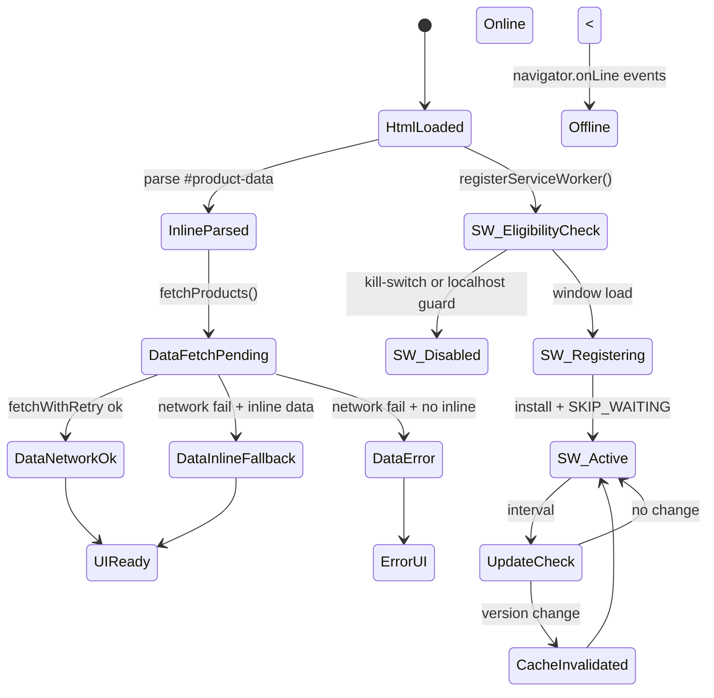

# Phase 1 - Logic & State Integrity Audit

Scope: runtime logic for offline/online transitions, first load vs repeat visits, SW lifecycle, cache invalidation/versioning, data fetch behavior, error handling, and race conditions.

## P0 Constraints (from Phase 0/0.5)
No unresolved P0 items found. Previously flagged P0s appear resolved in current repo state:
- Image pipeline paths align on assets/images across generate/rewrite/lint.
- tools/generate-image-variants.js defaults to repo data path with env override.
- tools/generate-sitemap.js derives categories from data/categories.json.

## 1. State Machine Model

Notes:
- Inline payload is the deterministic bootstrap; network refresh is best-effort.
- SW update path is timer-driven (5 min) and can trigger immediate activation + reload.

## 2. Invariants & Contracts
- `#product-data` is valid JSON and includes `initialProducts` on every product page.
- `productDataVersion` is either null or a non-empty string; never "undefined" or "null".
- All product data requests use a single resolver (same-origin default; explicit opt-in for cross-origin).
- Production data fetches are same-origin HTTPS; localhost HTTP is allowed only with explicit guard.
- Only one initializer sets `documentElement.dataset.enhancementsInit`.
- `initApp` is idempotent or guarded; retry does not double-bind listeners.
- SW cache prefixes are bumped when static assets or catalog data change.
- SW never caches `/service-worker.js` or `/cdn-cgi/image/*`.
- Product cache invalidation occurs only when a validated version change is detected.

## 3. Failure Mode Catalog (ranked)
1) High: Non-deterministic enhancement/data path based on csp.js vs main.js load order; offline/first-load behavior can diverge.
2) High: `productDataVersion` can be written as "undefined" when version is missing, causing repeated invalidation and cache busting loops.
3) Medium: Retry flow re-runs `initApp` and can duplicate event listeners and UI state mutations.
4) Medium: SW cache freshness metadata is unused; stale assets and product data can persist across offline sessions.
5) Medium: HTTPS-only fetch blocks localhost HTTP dev/CI, while update checks still run and set version, yielding inconsistent state.
6) Low: Cloudflare logo URLs are hard-coded; without CF, logo/preloads fail and are bypassed by SW cache.

## 4. Code-level Findings with Causal Chains
1) Dual enhancement/data init paths are timing-dependent
- Evidence: `src/js/csp.js:348`, `src/js/main.js:27`, `src/js/csp.js:126`, `src/js/modules/seo.js:82`
- Chain: csp.js async runs first -> sets `enhancementsInit` -> main.js exits early -> structured data and enhancement logic runs from csp.js (network-only data fetch) -> offline/first-load behavior diverges from the bundled path that prefers inline/shared data.
- Impact: Non-deterministic SEO/structured data injection and extra network fetches depending on load order.

2) Data endpoint is duplicated across modules
- Evidence: `src/js/script.mjs:817`, `src/js/modules/seo.js:82`, `src/js/csp.js:126`
- Chain: three modules build `/data/product_data.json` independently -> no single policy for overrides/allowlists -> future changes risk inconsistent origin rules or caching behaviors.
- Impact: Harder to audit and enforce deterministic data boundary (Phase 0.5C).

3) Update check can poison `productDataVersion`
- Evidence: `src/js/script.mjs:366`, `src/js/script.mjs:379`, `src/js/script.mjs:386`, `src/js/script.mjs:817`
- Chain: update check reads `data.version` without validation -> if missing, stores "undefined" -> every interval triggers invalidation + notification -> `fetchProducts` uses `?v=undefined`.
- Impact: Repeated invalidations and cache misses; noisy update UX; non-deterministic cache busting.

4) Retry path re-initializes without guard
- Evidence: `src/js/script.mjs:970`, `src/js/script.mjs:1351`
- Chain: network failure -> error UI -> retry button calls `initApp` -> handlers registered again -> multiple filter/cart listeners fire.
- Impact: Duplicate UI actions and potential double network calls after recovery.

5) SW cache freshness metadata is unused
- Evidence: `service-worker.js:94`, `service-worker.js:222`
- Chain: responses are timestamped but fetch handler does not check `isCacheFresh` -> cached entries can live forever until cache prefix bump or explicit invalidation.
- Impact: Stale catalog/assets after long offline or flaky network.

6) Cloudflare logo URLs are hard-coded and bypassed by SW
- Evidence: `templates/partials/navbar.ejs:6`, `templates/index.ejs:32`, `templates/category.ejs:22`, `service-worker.js:164`
- Chain: templates preload and use `/cdn-cgi/image/...` -> SW bypasses `/cdn-cgi` -> without CF, logo fails online and never caches offline.
- Impact: Broken logo + wasted LCP preload on GitHub Pages without explicit CF.

7) HTTPS-only fetch blocks localhost runtime
- Evidence: `src/js/script.mjs:753`, `src/js/script.mjs:366`
- Chain: `fetchWithRetry` rejects non-HTTPS -> local HTTP dev servers fail to fetch data -> update check still runs and sets version -> app shows error despite reachable data.
- Impact: Local dev/test instability and inconsistent version state.

## 5. PR-ready Fix Plan
PR 1 - Consolidate runtime initialization and data endpoint resolver
- Scope: `src/js/csp.js`, `src/js/main.js`, `src/js/modules/seo.js`, `src/js/script.mjs`, new `src/js/utils/data-endpoint.mjs`
- Changes: keep csp.js limited to CSP + deferred style enablement; move all enhancements/data fetch to main.js; introduce `resolveProductDataUrl({ version })` and use it everywhere.
- Acceptance criteria:
  - Only main.js sets `documentElement.dataset.enhancementsInit`.
  - No `product_data.json` fetch happens inside csp.js.
  - All product data fetches use the resolver (same-origin default).
- Tests:
  - Node test for `resolveProductDataUrl` (default, versioned, override rules).
  - Playwright: single structured data injection and only one network fetch for product data on first load.

PR 2 - Harden version handling and localhost HTTP policy
- Scope: `src/js/script.mjs`
- Changes: validate `currentVersion` before updating localStorage or invalidating caches; allow HTTP only for localhost when explicitly enabled (per Phase 0.5).
- Acceptance criteria:
  - `productDataVersion` is never set to "undefined"/"null".
  - Update notification fires only when version is a non-empty string and changes.
  - Localhost HTTP fetch is allowed only with explicit flag or hostname allowlist.
- Tests:
  - Unit test for version normalization and invalidation guard.
  - Unit test for localhost HTTP allowlist (reject non-localhost HTTP).

PR 3 - Make `initApp` retry idempotent
- Scope: `src/js/script.mjs`
- Changes: add a guard flag or cleanup routine so retry does not double-bind listeners; alternatively, change retry to `window.location.reload()`.
- Acceptance criteria:
  - Clicking retry multiple times does not add duplicate listeners or duplicate network requests.
- Tests:
  - Playwright: simulate failed fetch, click retry twice, ensure only one set of event handlers (one request for product data after recovery).

PR 4 - Enforce cache freshness or remove unused freshness metadata
- Scope: `service-worker.js`
- Changes: use `isCacheFresh` when serving cached responses (stale-while-revalidate) or remove the timestamp logic and document version bump rules.
- Acceptance criteria:
  - Cached product data is refreshed when stale and online; offline can still serve cached data.
  - No dead freshness code remains.
- Tests:
  - Node test for `isCacheFresh` and cache decision logic using exported helpers.
  - Playwright: after simulating a version bump, product data is refreshed without requiring a manual cache clear.

PR 5 - Remove Cloudflare-only logo paths unless explicitly enabled
- Scope: `templates/partials/navbar.ejs`, `templates/index.ejs`, `templates/category.ejs`, `tools/utils/product-mapper.js` (or shared helper)
- Changes: use local logo by default; only emit `/cdn-cgi/image/...` when CF is explicitly enabled.
- Acceptance criteria:
  - Default build contains no `/cdn-cgi/image` references.
  - With CF flag enabled, logo and preload use CF consistently.
- Tests:
  - Node test rendering templates with CF on/off and asserting logo URLs.

## 6. Executable Test Plan (Playwright preferred)
1) First load online, then offline reload
- Build and serve `build/` with `scripts/dev-server.mjs build`.
- Load `/index.html`, wait for products, and wait for SW ready.
- Toggle offline, reload the page.
- Expect: offline indicator visible, products rendered from cache/inline, no hard crash.

2) Version change invalidates product cache
- Intercept `/data/product_data.json` to return version `v1`, load page, then switch interceptor to `v2`.
- Trigger update check (wait for interval or call a test hook).
- Expect: update notification once; `localStorage.productDataVersion` == `v2`; cache invalidation message sent.

3) Retry flow idempotence
- Intercept `/data/product_data.json` to return 500 on first load.
- Verify error UI and click "Intentar nuevamente" twice.
- Restore success response and click retry.
- Expect: only one network request after recovery and no duplicated UI updates.

4) Localhost HTTP policy
- Serve over HTTP on localhost with SW disabled; enable explicit localhost HTTP flag.
- Expect: data fetch succeeds only when flag is set; otherwise fails with clear error.

5) Cloudflare logo toggle
- Build with CF disabled and verify rendered HTML contains `/assets/images/web/logo.webp` and no `/cdn-cgi/image`.
- Build with CF enabled and verify the opposite.
